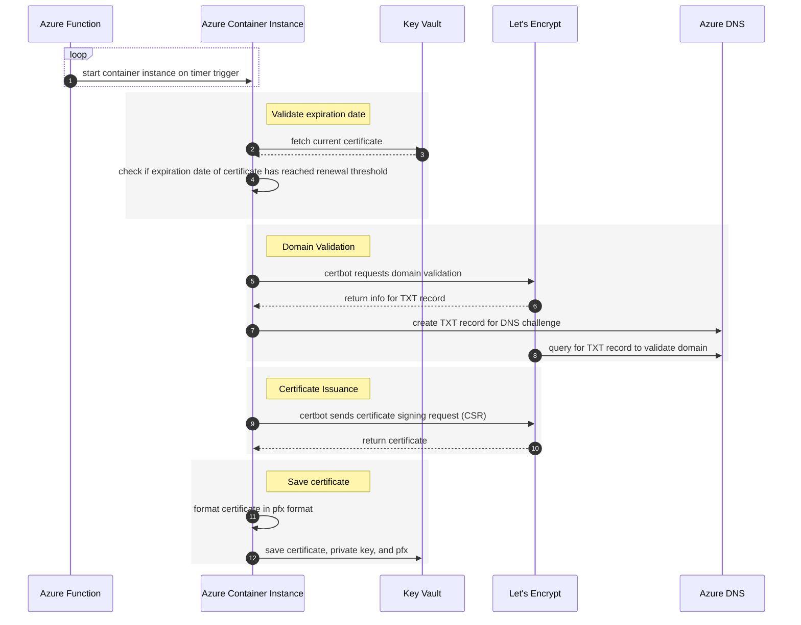

# TODO - Rough notes for lets encrypt automation

## Diagram



## rough notes

TODO: clean up and organize

context behind setup.

- need central location to manage certificates and automation
  - multiple clusters and app gateways need access to same wildcard cert
- didn't use something like cert-manager because it is tied to a specific cluster
  - running in multiple clusters increases likelihood of hitting lets encrypt rate limits
  - clusters are shutdown and restarted daily, so running in only one cluster can cause timing issues
  - certificates are generated in the cluster, but external resources need access
- certbot is recommended client by lets encrypt

TODO: overall setup:

- [x] docker image with az cli and certbot

- [ ] managed identity for function
- [x] managed identity for aci

- [ ] double check authn/authz to azure function triggers
- [ ] how to auth with managed identity in aci docker container
- [ ] double check public vs private ip settings for aci
  - private needs to be deployed in a vnet/subnet
  - ensure container is not exposed to interned or exposing unnecessary ports
- [ ] needs permissions to start aci
- [ ] needs permissions to read and set keys in key vault
- [ ] needs permissions to create and delete TXT records in dns zone

- [ ] azure function with timer trigger creates azure container instance
- [x] aci can access docker image
- [ ] aci runs generate-certs.sh on startup
- [x] docker image checks key vault for certificate expiration
- [x] if certificate is expired, run certbot to renew certificate
- [x] generate pfx file
- [x] save pfx, cert, and key to key vault

- [ ] look into linter for bash scripts
- [ ] run linter on bicep files if it is not automatic already
- [ ] run checkov on dockerfile if it is not captured in existing workflow

- [ ] figure out a good way to upload the cert info to dev and preprod key vaults
  - each env has its own key vault
  - the certificate information can be the same wildcard certificate

- [ ] GH workflow for docker build and push

commands

```bash

# build docker image in cert-automation directory from root directory
docker build -t ghcr.io/retaildevcrews/cert-automation -f cert-automation/Dockerfile .

# run docker image locally
docker run -it --entrypoint sh --rm ghcr.io/retaildevcrews/cert-automation

# create a PAT and login
# https://docs.github.com/en/packages/working-with-a-github-packages-registry/working-with-the-container-registry#authenticating-with-a-personal-access-token-classic
#
# create token with package access only by going here https://github.com/settings/tokens/new?scopes=write:packages
# export CR_PAT=YOUR_TOKEN
# echo $CR_PAT | docker login ghcr.io -u USERNAME --password-stdin

# push image to ghcr
docker push ghcr.io/retaildevcrews/cert-automation

```

dev/test locally

```bash

az login
az account set -s <subscription name or id>
az account show

# test script locally
# these can be set in ACI as env vars
export AZURE_DNS_RESOURCE_GROUP="dns-rg"
export AZURE_DNS_ZONE="austinrdc.dev"
export CERTBOT_ACCOUNT_EMAIL="<email address here>"
export CERTBOT_CERTNAME="austinrdc-dev"
export CERTBOT_DOMAIN="*.austinrdc.dev"
export KV_FULL_CHAIN_SECRET_NAME="ak-automation-test-tls-crt"
export KV_NAME="kv-aks-jxdthrti3j3qu"
export KV_PFX_SECRET_NAME="ak-automation-test-tls-pfx"
export KV_PRIVATE_KEY_SECRET_NAME="ak-automation-test-tls-key"
# export LETS_ENCRYPT_ENVIRONMENT="<staging or production. defaults to staging if not set>"
# export NUM_DAYS_TO_RENEW="<number of days before certificate expiration to renew. defaults to 30>"

# create directory for certbot
# already exists in docker image
mkdir -p ~/certbot-files

# run script
./cert-automation/certbot/generate-certs.sh

```

deploying container instance with bicep template

```bash

AUTOMATION_RG="rg-fdpo-automation"

az deployment group create \
  --resource-group $AUTOMATION_RG \
  --template-file ./cert-automation/deploy.bicep \
  --confirm-with-what-if \
  --parameters \
    certbotAccountEmail="$CERTBOT_ACCOUNT_EMAIL" \
    kvFullChainSecretName="$KV_FULL_CHAIN_SECRET_NAME" \
    kvName="$KV_NAME" \
    kvPfxSecretName="$KV_PFX_SECRET_NAME" \
    kvPrivateKeySecretName="$KV_PRIVATE_KEY_SECRET_NAME"

```
