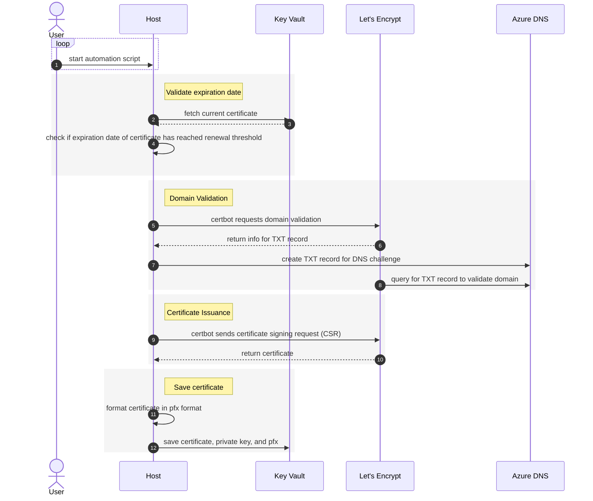

# Lets Encrypt certificate generation with certbot

## Diagram



## Using scripts to generate and save certs

Login to az cli.

```bash

az login
az account set -s <subscription name or id>
az account show

```

Verify certbot is installed.

```bash

certbot --version

# Use the command below to install if it is not installed already.
# sudo apt-get install certbot=1.12.0-2

```

Set environment variables.

> **Note**
>
> When using Let's Encrypt, it is recommended to test first using the staging environment before moving to production. This will allow you to test the process without hitting the [rate limits](https://letsencrypt.org/docs/rate-limits/).
>
> The default setting for the helper script, `LETS_ENCRYPT_ENVIRONMENT`, is set to "staging".

```bash

# DNS Zone resource group
export AZURE_DNS_RESOURCE_GROUP="dns-rg"
# DNS Zone to use for domain validation
export AZURE_DNS_ZONE="austinrdc.dev"
# Let's Encrypt account email address. Used for certificate notifications.
export CERTBOT_ACCOUNT_EMAIL="<email address for certificate notifications here>"
# Name of certificate used by Certbot
export CERTBOT_CERTNAME="austinrdc-dev"
# Domain to request certificate for
export CERTBOT_DOMAIN="*.austinrdc.dev"
# Name of Key Vault secret where certificate is stored
export KV_FULL_CHAIN_SECRET_NAME="appgw-ingress-internal-aks-ingress-tls"
# Name of key Vault to upload certificate secrets
export KV_NAME="kv-aks-jxdthrti3j3qu"
# Name of Key Vault secret to save certificate in PFX format. Used by the App Gateway.
export KV_PFX_SECRET_NAME="sslcert"
# Name of Key Vault secret to save certificate private key
export KV_PRIVATE_KEY_SECRET_NAME="appgw-ingress-internal-aks-ingress-key"
# Let's Encrypt environment to use. staging or production, defaults to staging if not set.
# Reminder to test first with the staging environment before moving to production.
export LETS_ENCRYPT_ENVIRONMENT="staging"
# Number of days before certificate expiration to renew. Defaults to 30.
export NUM_DAYS_TO_RENEW=30

```

Run certificate generation script.

```bash

# Create a directory that is writable by the current user
# This allows you to run certbot without sudo if desired
mkdir -p ~/certbot-files

# run script
./cert-automation/certbot/generate-certs.sh

```
