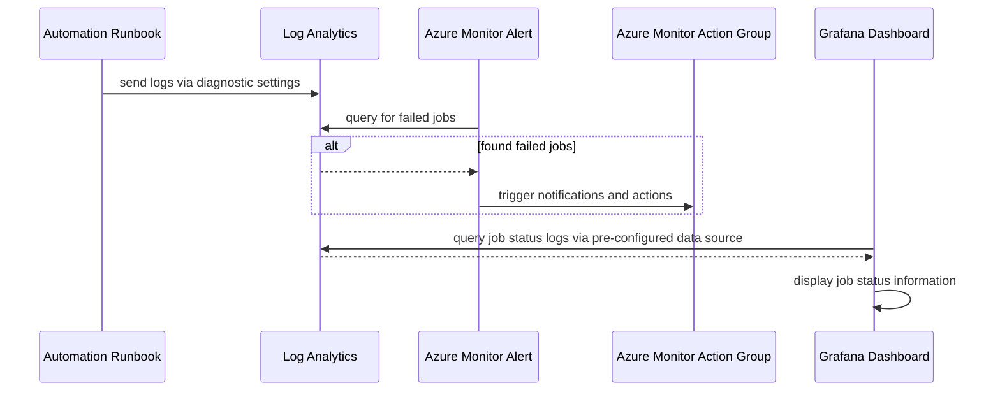

# Azure Automation Account Observability

These instructions guide you through setting up observability for Azure Automation Account. Diagnostic settings and Grafana dashboards will be created, including guidance on how to use the information they provide.

## Diagram



## Prerequisites

These instructions assume the following resources have already been created as part of the [main infrastructure setup](/README.md).

- [Automation Account and Runbooks](/docs/Firewall-Automation.md)
- [Grafana](/monitoring/README.md)
- [Log Analytics](/README.md#2-createhubsh)

## Diagnostic Setting Setup

Set the environment variables described below for the Diagnostic Setting configuration.

```bash

# Name of the Diagnostic Setting
export DIAGNOSTIC_SETTING_NAME="automation-diagnostic-setting"

# Name of the Automation Account to attach the Diagnostic Setting to
export AUTOMATION_ACCOUNT_NAME=<name of automation account>

# Resource Group of the Automation Account to attach the Diagnostic Setting to
export AUTOMATION_ACCOUNT_RG=<resource group of automation account>

# Name of Log Analytics where logs will be sent
# Recommend using hub log analytics if automation affects both hub and spoke resources
export LA_WORKSPACE_NAME=<name of log analytics workspace>

# Resource group of Log Analytics where logs will be sent
export LA_WORKSPACE_RG=<resource group of log analytics workspace>

```

Run the script to create the Diagnostic Setting.

```bash

./scripts/Create-Automation-Diagnostics.sh

```

## Observability

### Grafana Dashboard

TODO: how the grafana dashboard is setup with flux, including how to add to different clusters

- what information is displayed in grafana dashboard?
  - time series of job status. ex: x number of completed, y number of failed
  - status of automation, ex: is job currently running?

### Troubleshooting with Grafana Dashboard

TODO: how to use grafana dashboard for troubleshooting

- dashboard will be created to show history of runbook job status
- will also attempt to show state of resources that runbooks affect. ex: status of clusters, firewall, and gateway
- will include documentation of how to use the information of the dashboard to troubleshoot

### Troubleshooting with Log Analytics

TODO: how to use data from log analytics for troublehooting, with example queries

- which log analytics?
  - dev hub log analytics
  - automation account has multiple runbooks that span hub/spoke and dev/preprod resources
  - not taking on the scope of reorganizing in this task
  - TODO:
    - there might be a task for this already. find and link.
    - make a note about this decision in this task.

### Fixing issues

TODO: how to potentially resolve specific issues. eg: manually start resource that was not restarted

## TODO: clean up rough notes below

TODO: check how much data will be added to logs and how that would affect subscription costs

TODO: Create follow up task for alerts

- how are alerts structured? query, time range, threshold, group or individual alerts per runbooks, etc?
  - saving alerts for a separate conversation after we see what logs and metrics are available
- which action group?
  - TODO: find location of team action group
