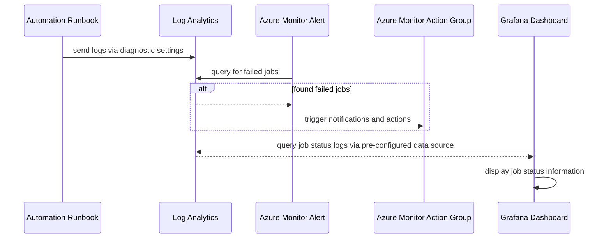

# Azure Automation Account Observability

TODO: goal of this doc

## Diagram

## Prerequisites

TODO: list prereqs and other assumptions

## Diagnostic Setting Setup

TODO: how to run setup

## Observability

### Troubleshooting with Log Analytics

TODO: how to use data from log analytics for troublehooting, with example queries

### Grafana Dashboard

TODO: how the grafana dashboard is setup with flux, including how to add to different clusters

### Troubleshooting with Grafana Dashboard

TODO: how to use grafana dashboard for troubleshooting

### Fixing issues

TODO: how to potentially resolve specific issues. eg: manually start resource that was not restarted

## TODO: plan notes

TODO: plan is to address these points in the designs, docs, and implementation

implementation

- what assumptions are being made about the environment during implementation?
  - TODO: incorporate into prereq section of docs
  - These resources already exist
    - Automation Account
    - Runbooks
    - Log Analytics
    - Action Group
    - Grafana
  - point to documentation there the resources are there
- which log analytics?
  - dev hub log analytics
  - automation account has multiple runbooks that span hub/spoke and dev/preprod resources
  - not taking on the scope of reorganizing in this task
  - TODO:
    - there might be a task for this already. find and link.
    - make a note about this decision in this task.
- which diagnostic settings?
  - JobLogs
  - JobStreams
- what information is displayed in grafana dashboard?
  - time series of job status. ex: x number of completed, y number of failed
  - status of automation, ex: is job currently running?

dev experience and operations

- plans to make setup repeatable
  - TODO: incorporate into setup instructions and scripts
  - Solution makes no internal assumptions about resource names, location, subscription, or tenant by doing string interpolation.
  - These can be done outside the solution for easier setup, but should still allow user to change without editing solution.
- how to test without deploying entire aks baseline setup?
  - TODO: incorporate into dev and test cycle while working on solution
  - should be able to test in any subscription if prereq resources are created
- impact to point dev experience
  - TODO: incorporate into docs and dhasboards
  - dashboard will be created to show history of runbook job status
  - will also attempt to show state of resources that runbooks affect. ex: status of clusters, firewall, and gateway
  - will include documentation of how to use the information of the dashboard to troubleshoot
  - will include manual remediation steps for any known error states
- impact to spend in subscription
  - solution will add new diagnostic setting for send logs to log analytics
  - TODO:
    - check on pricing for diagnostic settings
    - check on how much data runbook is sending during testing and use a estimate for for final solution
    - make a note of finding in the task

next steps

- Create follow up task for alerts
  - how are alerts structured? query, time range, threshold, group or individual alerts per runbooks, etc?
    - saving alerts for a separate conversation after we see what logs and metrics are available
  - which action group?
    - TODO: find location of team action group
