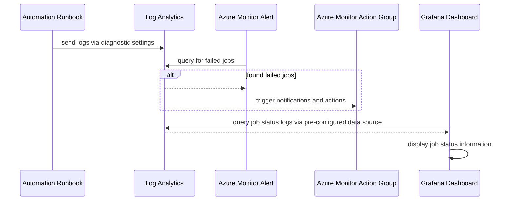

# Azure Automation Account Observability

TODO: goal of this doc

## Diagram



## Prerequisites

TODO: list prereqs and other assumptions

- These resources already exist
  - Automation Account
  - Runbooks
  - Log Analytics
  - Action Group
  - Grafana
- point to documentation there the resources are there

## Diagnostic Setting Setup

TODO: set env vars and describe their purpose

```bash

export DIAGNOSTIC_SETTING_NAME="automation-diagnostic-setting"
export AUTOMATION_ACCOUNT_NAME="aa-wcnp-firewall-automation-dev"
export AUTOMATION_ACCOUNT_RG="rg-wcnp-firewall-automation-dev"
export LA_WORKSPACE_NAME="la-hub-eastus-zsgmpltrjrhy6"
export LA_WORKSPACE_RG="rg-wcnp-dev-hub"

```

TODO: run script

```bash

./scripts/Create-Automation-Diagnostics.sh

```

## Observability

### Troubleshooting with Log Analytics

TODO: how to use data from log analytics for troublehooting, with example queries

- which log analytics?
  - dev hub log analytics
  - automation account has multiple runbooks that span hub/spoke and dev/preprod resources
  - not taking on the scope of reorganizing in this task
  - TODO:
    - there might be a task for this already. find and link.
    - make a note about this decision in this task.

### Grafana Dashboard

TODO: how the grafana dashboard is setup with flux, including how to add to different clusters

- what information is displayed in grafana dashboard?
  - time series of job status. ex: x number of completed, y number of failed
  - status of automation, ex: is job currently running?

### Troubleshooting with Grafana Dashboard

TODO: how to use grafana dashboard for troubleshooting

- dashboard will be created to show history of runbook job status
- will also attempt to show state of resources that runbooks affect. ex: status of clusters, firewall, and gateway
- will include documentation of how to use the information of the dashboard to troubleshoot

### Fixing issues

TODO: how to potentially resolve specific issues. eg: manually start resource that was not restarted

## TODO: clean up rough notes below

TODO: check how much data will be added to logs and how that would affect subscription costs

TODO: Create follow up task for alerts

- how are alerts structured? query, time range, threshold, group or individual alerts per runbooks, etc?
  - saving alerts for a separate conversation after we see what logs and metrics are available
- which action group?
  - TODO: find location of team action group
