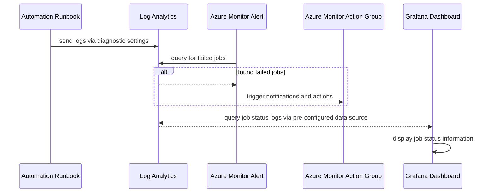
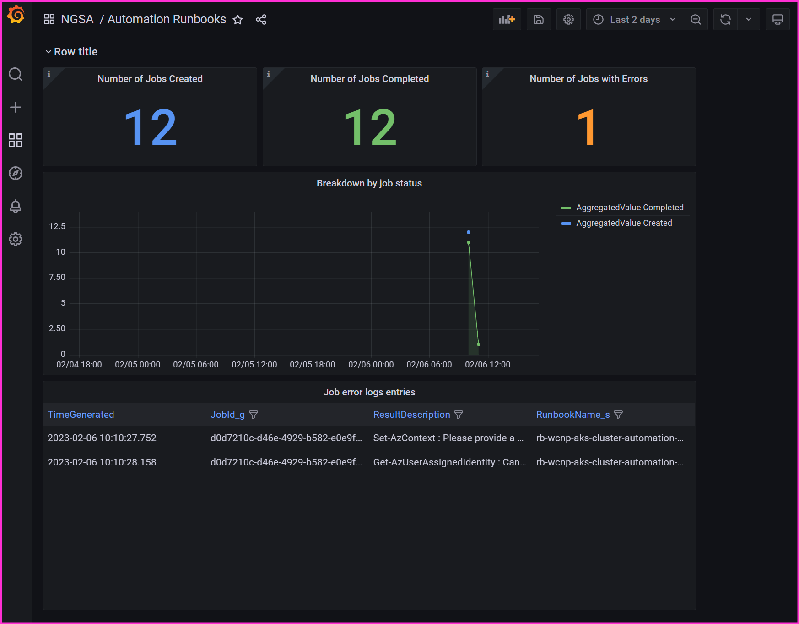
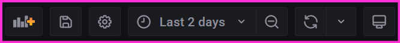
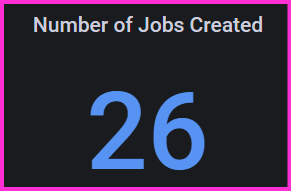
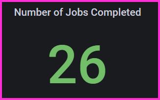
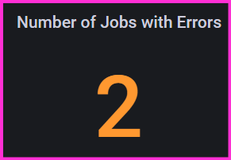
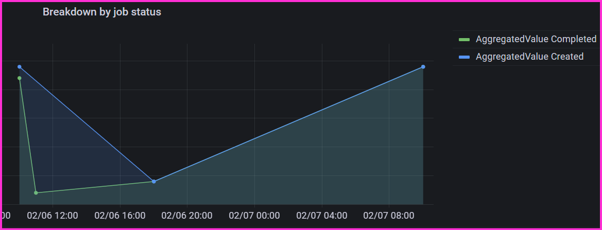
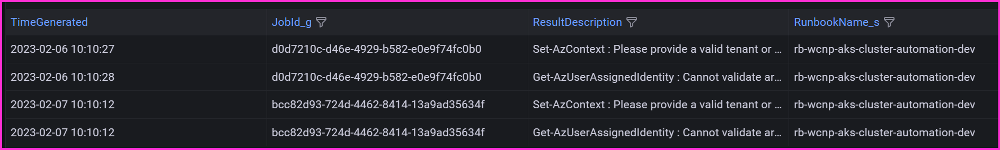

# Azure Automation Account Observability

These instructions guide you through setting up observability for Azure Automation Account. Diagnostic settings and Grafana dashboards will be created, including guidance on how to use the information they provide.

## Diagram



## Prerequisites

These instructions assume the following resources have already been created as part of the [main infrastructure setup](/README.md).

- [Automation Account and Runbooks](/docs/Firewall-Automation.md)
- [Grafana](/monitoring/README.md)
- [Log Analytics](/README.md#2-createhubsh)

## Diagnostic Setting Setup

Set the environment variables described below for the Diagnostic Setting configuration.

```bash

# Name of the Diagnostic Setting
export DIAGNOSTIC_SETTING_NAME="automation-diagnostic-setting"

# Name of the Automation Account to attach the Diagnostic Setting to
export AUTOMATION_ACCOUNT_NAME=<name of automation account>

# Resource Group of the Automation Account to attach the Diagnostic Setting to
export AUTOMATION_ACCOUNT_RG=<resource group of automation account>

# Name of Log Analytics where logs will be sent
# Recommend using hub log analytics if automation affects both hub and spoke resources
export LA_WORKSPACE_NAME=<name of log analytics workspace>

# Resource group of Log Analytics where logs will be sent
export LA_WORKSPACE_RG=<resource group of log analytics workspace>

```

Run the script to create the Diagnostic Setting.

```bash

./scripts/Create-Automation-Diagnostics.sh

```

## Grafana Dashboard Setup

- TODO: how the grafana dashboard is setup with flux, including how to add to different clusters

## Troubleshooting Automation Runbook Jobs

Below, you'll find guidance on how to use the information from the diagnostic setting for troubleshooting.

### Grafana Automation Dashboard Tool

Below is a detailed explanation of all elements on the Grafana dashboard for trouble shooting automation jobs.  

#### Log in for Dashboard

Locate the dashboard at the following [link](https://grafana-eastus-dev.austinrdc.dev/login) (https://grafana-eastus-dev.austinrdc.dev/login).  This link will bring a user to the Grafana dashboard. Click on the "Sign in with Microsoft" and navigate to the dashboard.


Figure 1:  Grafana login

#### Dashboard Elements


Figure 2:  Grafana Automation Dashboard

Once a user has logged in the dashboard, depicted in Figure 2 will display.  The graph has several areas of note that will each be discussed below.  The following list is a list and description of the elements.  

| Element Name | Element Description | Figure Number | Image |
| ------------ | ------------------- | ------------- | ----- |
| Login | Allows for seamless login to the Grafana environment. | [Figure 1](#log-into-automation-dashboard) | [](./assets/Automation-Dashboard/grafanaLogIn.png) |
| Dashboard | This is the overall dashboard, each element will be described below. | [Figure 2](#dashboard-elements) |[](./assets/Automation-Dashboard/grafanaLogIn.png) |
|Duration Selector | This selector allows a user to filter based on different time slices.  The default selector is set for 2 days. | [Figure 3](#time-range-selector) |[](./assets/Automation-Dashboard/grafanaLogIn.png) |
| Number of Jobs Created | Number of automation jobs "created" within the time segment selected. | [Figure 4](#number-of-jobs-created) |[](./assets/Automation-Dashboard/grafanaLogIn.png) |
| Number of Jobs Completed | Number of automation jobs "completed" within the time segment selected. | [Figure 5](#number-of-jobs-completed) |[](./assets/Automation-Dashboard/grafanaLogIn.png) |
| Number of Jobs with Errors | Number of automation jobs "with errors" within the time segment selected. | [Figure 6](#number-of-job-errors) |[](./assets/Automation-Dashboard/grafanaLogIn.png) |
| Time Series Diagram  | The time series diagramming the created/completed versus created and completed with errors. | [Figure 7](#time-series-diagram) |[](./assets/Automation-Dashboard/grafanaLogIn.png) |
| Log List | The log list allows a user to see the errors that occured, as indicated in the element in Figure 6. | [Figure 8](#error-log-entries) | [](./assets/Automation-Dashboard/grafanaLogIn.png) |

### Troubleshooting with Grafana Dashboard

#### Time Range Selector


Figure 3:  Grafana time line selection

As show above a user can use the dropdown to adjust the timeline by which the data in the graph is loaded and thus a person can do analysis to ascertain the health of the automation process.  As shown in [Figure 3](#time-range-selector).

#### Number of Jobs Created


Figure 4:  Grafana Jobs Created

In [figure 4](#number-of-jobs-created) the number of jobs created to run during this time segment is listed.  This number is misleading, as it does not mean "new automation jobs" were created, but rather automation job instances created for running.  This is similar to the concept in American game baseball of "[On Deck](https://www.dictionary.com/browse/on--deck)".

#### Number of Jobs Completed


Figure 5:  Grafana Jobs Completed

In [figure 5](#number-of-jobs-completed) the number of jobs completed during this time segment.  A job can complete with errors; do not consider jobs completed the difference between Jobs created, and Jobs with errors.  This is incorrect.  

A job can complete with errors, completed without errors, or error out and not complete.  These states can all be represented.  

#### Number of Job Errors


Figure 6:  Grafana Automation Dashboard

In [figure 6](#number-of-job-errors) the number of jobs with errors is listed.  This number can be jobs completed with errors, and jobs that errored without completing.  

#### Time Series Diagram


Figure 7:  Grafana Automation Dashboard

The diagram above is used to graphically see if jobs are diverging.  For example if the lines on this diagram are not in alignment it indicated errors have happened.  In the diagram above two (2) errors had happened showing the divergent lines.

#### Error Log Entries


Figure 8:  Grafana Automation Dashboard

In the log element section in [figure 8](#error-log-entries) shows the errors that have happened during the time segment selected.  This will allow a user to quickly scan the chart for any anomalies or issues.  

### Troubleshooting with Log Analytics

Log Analytics has information about Jobs and their logs that can be used for further troubleshooting. Below are some example queries to get started.

Find error entries from the Job logs. This is useful when a Job is finished, encoutered errors, but the Job was marked as Completed instead of Failed.

```kql

AzureDiagnostics |
  where ResourceProvider == "MICROSOFT.AUTOMATION"
  and Category == "JobStreams"
  and StreamType_s == "Error" |
project TimeGenerated, JobId_g, ResourceGroup, Resource, ResultType, ResultDescription, RunbookName_s, StreamType_s |
order by TimeGenerated desc

```

Find Jobs that finished in a Failed stated.

```kql

AzureDiagnostics |
where ResourceProvider == "MICROSOFT.AUTOMATION"
  and Category == "JobLogs"
  and ResultType == "Failed" |
project TimeGenerated, JobId_g, ResourceGroup, Resource, ResultType, RunbookName_s |
order by TimeGenerated desc

```

View all log entries for a specific Job, filtering by the JobId_g field.

```kql

AzureDiagnostics |
where Category == "JobStreams"
  and JobId_g == "<replace with specific job id>" |
order by TimeGenerated desc

```

For more example queries when troubleshooting Automation runbook jobs, refer to this [Azure documentation](https://learn.microsoft.com/en-us/azure/automation/automation-manage-send-joblogs-log-analytics#sample-queries-for-job-logs-and-job-streams).
