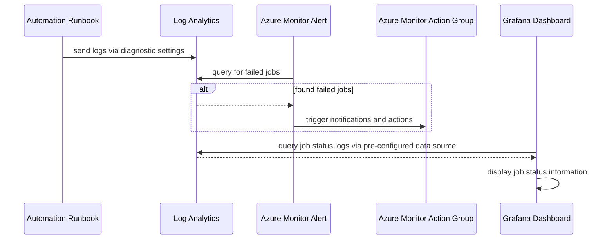

# Azure Automation Account Observability

These instructions guide you through setting up observability for Azure Automation Account. Diagnostic settings and Grafana dashboards will be created, including guidance on how to use the information they provide.

## Diagram



## Prerequisites

These instructions assume the following resources have already been created as part of the [main infrastructure setup](/README.md).

- [Automation Account and Runbooks](/docs/Firewall-Automation.md)
- [Grafana](/monitoring/README.md)
- [Log Analytics](/README.md#2-createhubsh)

## Diagnostic Setting Setup

Set the environment variables described below for the Diagnostic Setting configuration.

```bash

# Name of the Diagnostic Setting
export DIAGNOSTIC_SETTING_NAME="automation-diagnostic-setting"

# Name of the Automation Account to attach the Diagnostic Setting to
export AUTOMATION_ACCOUNT_NAME=<name of automation account>

# Resource Group of the Automation Account to attach the Diagnostic Setting to
export AUTOMATION_ACCOUNT_RG=<resource group of automation account>

# Name of Log Analytics where logs will be sent
# Recommend using hub log analytics if automation affects both hub and spoke resources
export LA_WORKSPACE_NAME=<name of log analytics workspace>

# Resource group of Log Analytics where logs will be sent
export LA_WORKSPACE_RG=<resource group of log analytics workspace>

```

Run the script to create the Diagnostic Setting.

```bash

./scripts/Create-Automation-Diagnostics.sh

```

## Grafana Dashboard Setup

- TODO: how the grafana dashboard is setup with flux, including how to add to different clusters

## Troubleshooting Automation Runbook Jobs

Below, you'll find guidance on how to use the information from the diagnostic setting for troubleshooting.

### Troubleshooting with Grafana Dashboard

- TODO: how to use grafana dashboard for troubleshooting
  - what information is displayed in grafana dashboard?
  - how to interpret it?
  - when to take action?

### Troubleshooting with Log Analytics

Log Analytics has information about Jobs and their logs that can be used for further troubleshooting. Below are some example queries to get started.

Find error entries from the Job logs. This is useful when a Job is finished, encoutered errors, but the Job was marked as Completed instead of Failed.

```kql

AzureDiagnostics |
  where ResourceProvider == "MICROSOFT.AUTOMATION"
  and Category == "JobStreams"
  and StreamType_s == "Error" |
project TimeGenerated, JobId_g, ResourceGroup, Resource, ResultType, ResultDescription, RunbookName_s, StreamType_s |
order by TimeGenerated desc

```

Find Jobs that finished in a Failed stated.

```kql

AzureDiagnostics |
where ResourceProvider == "MICROSOFT.AUTOMATION"
  and Category == "JobLogs"
  and ResultType == "Failed" |
project TimeGenerated, JobId_g, ResourceGroup, Resource, ResultType, RunbookName_s |
order by TimeGenerated desc

```

View all log entries for a specific Job, filtering by the JobId_g field.

```kql

AzureDiagnostics |
where Category == "JobStreams"
  and JobId_g == "<replace with specific job id>" |
order by TimeGenerated desc

```

TODO: saving for dashboard. remove from docs?

```kql

AzureDiagnostics |
where ResourceProvider == "MICROSOFT.AUTOMATION"
  and Category == "JobLogs"
  and ResultType != "Started" |
summarize AggregatedValue = count() by ResultType, bin(TimeGenerated, 1h) |
order by ResultType desc

```

For more example queries when troubleshooting Automation runbook jobs, refer to this [Azure documentation](https://learn.microsoft.com/en-us/azure/automation/automation-manage-send-joblogs-log-analytics#sample-queries-for-job-logs-and-job-streams).

### Fixing issues

- TODO: how to potentially resolve specific issues. eg: manually start resource that was not restarted

## TODO: clean up rough notes below

- TODO: create follow up task for alerts
  - how are alerts structured? query, time range, threshold, group or individual alerts per runbooks, etc?
  - which action group?

- TODO: take notes in current task 1124
  - which log analytics and why?
    - dev hub log analytics
    - automation account has multiple runbooks that span hub/spoke and dev/preprod resources
    - not taking on the scope of reorganizing in this task
    - TODO:
      - there might be a task for this already. find and link.
  - saving alerts for a separate conversation after we see what logs and metrics are available
  - subscription costs
    - around 0.02 GB per day increase in logs during testing
    - includes entries from test jobs that were running every hour
    - around 5 cents per day for log analytics ingestion
  - add notes about why new directory is being used for grafana dashboard.
    - need to target specific dashboard config maps for substitution so others are not affected
    - alternative is disable all other dashboard config maps by adding special annotation
    - worried about situation someone forgets to disable and flux messes up dashboard accidentally
