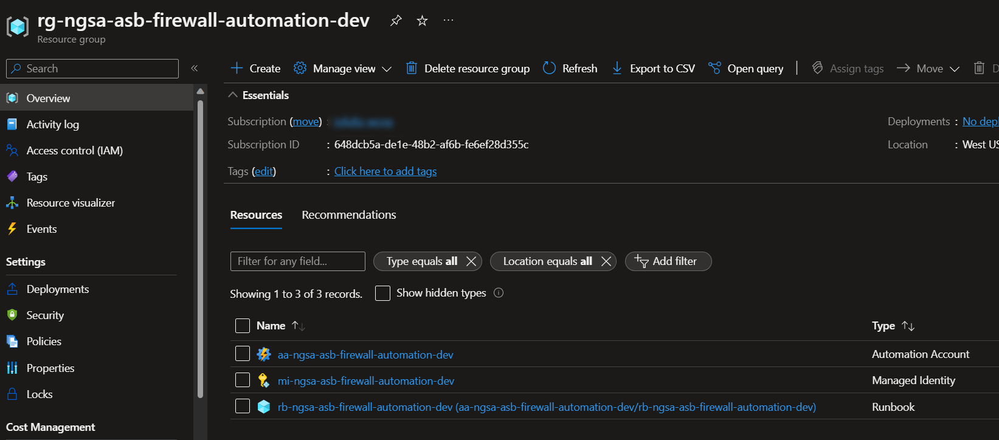

# Web Application Firewall (WAF) Allocation/De-Allocation Automation

Azure Firewall has [costs (Azure Firewall pricing link)](https://azure.microsoft.com/en-gb/pricing/details/azure-firewall/#pricing) associated with it which can be optimized by allocating and de-allocating the firewall when appropriate.  The instructions below describe how to implement an Azure Automation Runbook that will automate firewall allocation and de-allocation on a schedule, and enable and disable associated alerts to minimize nonessential systems communications.

## Login to Azure

```bash
az login 

###  show your Azure accounts
az account list -o table

###  select the Azure subscription if necessary
az account set -s {subscription name or Id}
```

## Prerequisites

### PowerShell, Azure CLI and Azure CLI Extensions

Before proceeding, verify that the correct version of Azure CLI and required extensions have been installed:

- Azure CLI 2.0 or greater
  - Run the command `az version`
  - If the correct version is not installed, install Azure CLI from [here](https://learn.microsoft.com/en-us/cli/azure/install-azure-cli)

- Azure CLI Extension for Automation
  - Run the command `az extension show --name automation -o table`
  - If the Azure CLI extension for automation is not installed, install by running command `az extension add --name automation`   [reference here](https://github.com/Azure/azure-cli-extensions/tree/main/src/automation#how-to-use).

- Azure CLI Extension for Monitor
  - Run the command `az extension show --name monitor-control-service -o table`
  - If the Azure CLI extension for monitor-control-service is not installed, install by running command `az extension add --name monitor-control-service` [reference here](https://github.com/Azure/azure-cli-extensions/tree/main/src/monitor-control-service#how-to-use)

- Azure Powershell modules
  - Open up a PowerShell Terminal
  - [Install Azure PowerShell Modules](https://learn.microsoft.com/en-us/powershell/azure/install-az-ps?view=latest#installation) from the prompt using the command `Install-Module -Name Az -Scope CurrentUser -Repository PSGallery -Force`

Note: *The Azure CLI Automation extension is in an experimental stage.  Currently it does not implement all functionality needed.  As a result the Az Module, specifically for automation, monitoring, and authentication can be used at the time of writing.*

### Update Environment Variable Values

The file Firewall-Automation-Infrastructure-Variables.env must be created from the template to include relevant values for all of the required environment variables. It will be used by the script [Firewall-Automation-Infrastructure.sh](../scripts/Firewall-Automation/Firewall-Automation-Infrastructure.sh) as part of the automated setup. The file `Firewall-Automation-Infrastructure-Variables.env` will be ignored by git.

```bash

# Set input variable values.
export tenantId=$(az account show -o tsv --query tenantId)
export subscriptionName=$(az account show -o tsv --query id)
export deploymentName='' #e.g wcnptest
export environment='' #e.g dev or preprod
export location='' #e.g eastus
export keyVaultName=''#e.g kv-aks-abcdefg
export keyVaultRGName=''#key vault resource group name

# Create Firewall-Automation-Infrastructure-Variables.sh from template with values from local variables set above.
cat scripts/Firewall-Automation/Firewall-Automation-Infrastructure-Variables-Template.txt | envsubst > scripts/Firewall-Automation/Firewall-Automation-Infrastructure-Variables.env

# Set environment variables 
source scripts/Firewall-Automation/Firewall-Automation-Infrastructure-Variables.env

```

### Service Principal and Role Assignments

The execution of the automation infrastructure setup script **Firewall-Automation-Infrastructure.sh** requires a Service Principal to be created as part of the provisioning process. The Service Principal is only needed for setup, and it is not utilized to execute the RunBook automation.

Service Principal | Purpose |
-----------------|---------|
 e.g:  firewall-automation-sp-\<env> | Application Identity |

#### Required Role Assignments

Role assignments scoped to the subscription need to be created and assigned to the service principal **firewall-automation-sp-\<env>**. The service principal requires role assignments with the roles listed in the table below to enable Powershell Connect and Automation commands to work.

| Role | Type | Scope |
| --- | --- | --- |
| Automation Contributor  | App | Subscription |
| Managed Identity Operator  | App | Subscription |

#### Create Service Principal and Role Assignments and store Secrets in Key Vault

Run the commands below to create the service principal and the required role assignments

```bash

# Replace the correct SP name e.g 'firewall-automation-sp'
local servicePrincipalName=''

# Get the current Susbcription Id 
local subscriptionId=$(az account show -o tsv --query id)

# Create SP and get secret 
local automationClientSecret=$(az ad sp create-for-rbac -n $servicePrincipalName --query password -o tsv)

# Get Service principal ClientId 
local automationClientId=$(az ad sp list --all --filter "displayname eq '${servicePrincipalName}'" --query "[].appId" -o tsv)

# Create Managed Identity Operator role assignment 
az role assignment create --role "Managed Identity Operator" --assignee $automationClientId --scope "/subscriptions/${subscriptionId}"

# Create Automation Contributor role assignment 
az role assignment create --role "Automation Contributor" --assignee $automationClientId --scope "/subscriptions/${subscriptionId}"

# Add Automation Client secrets to key vault

# give logged in user access to key vault
az keyvault set-policy --secret-permissions set --object-id $(az ad signed-in-user show --query id -o tsv) -n $ASB_KV_Name -g $ASB_KV_ResourceGroupName

# set app secrets
az keyvault secret set -o table --vault-name $ASB_KV_Name --name "AutomationClientSecret" --value $automationClientSecret
az keyvault secret set -o table --vault-name $ASB_KV_Name --name "AutomationClientId" --value $automationClientId

# remove logged in user's access to key vault
az keyvault delete-policy --object-id $(az ad signed-in-user show --query id -o tsv) -n $ASB_KV_Name -g $ASB_KV_ResourceGroupName

```

## Parameters Needed to Proceed

### Parameters for Bash Execution

| Parameter Name                        |                                             Example Value                                             | Script Needed For |
| ------------------------------------- | :---------------------------------------------------------------------------------------------------: | ----------------- |
| ASB_FW_TenantId                       |                                  00000000-0000-0000-0000-000000000000                                 | bash              |
| ASB_FW_Subscription_Name              |                                              JoFultz-Team                                             | bash              |
| ASB_FW_Base_NGSA_Name                 |                                                ngsa-asb                                               | bash              |
| ASB_FW_Base_Automation_System_Name    |                                                  bash                                                 | bash              |
| ASB_FW_Environment                    |                                                  dev                                                  | bash              |
| ASB_FW_PowerShell_Runbook_File_Name   |                                    Firewall-Automation-Runbook.ps1                                    | bash              |
| ASB_FW_Location                       |                                                 westus                                                | bash              |
| ASB_FW_Sku                            |                                                 Basic                                                 | bash              |
| ASB_FW_PowerShell_Runbook_Description | This runbook automates the allocation and de-allocation of a firewall for the purposes of scheduling. | bash              |
| ASB_FW_Environment                    |                                                  dev                                                  | bash              |
| firewallName                          |                                              fw-centralus                                             | bash              |

### Parameters for PowerShell Execution

The PowerShell file needed to create the runbook schedules is called from the bash script, and re-uses the environment variables to then generate all parameters needed.  

## Infrastructure & Assets Creation List

The following infrastructure assets should be established in the subscription with the Azure Firewall(s) to be managed once all aspects of this document are fulfilled.  Though six (6) items are listed, technically one (1) item is an import of content to the body of the Azure Automation Runbook so this item will not show up in the portal without deeper investigation.  

|     | Resource                                  |                                                                                       Links                                                                                      | Description                                                                                                                                                                 |
| :-: | :---------------------------------------- | :------------------------------------------------------------------------------------------------------------------------------------------------------------------------------: | --------------------------------------------------------------------------------------------------------------------------------------------------------------------------- |
|  1. | Resource Group                            |                                                 [link](https://learn.microsoft.com/en-us/cli/azure/manage-azure-groups-azure-cli)                                                | Create "sibling" resource group in subscription for Azure Automation infrastructure.                                                                                        |
|  2. | Automation Account                        |                     [link](https://learn.microsoft.com/en-us/azure/templates/microsoft.automation/automationaccounts?pivots=deployment-language-arm-template)                    | Create an Automation Account that will execute the automation.                                                                                                              |
|  3. | User-Assigned Managed Identity            | [link](https://learn.microsoft.com/en-us/azure/active-directory/managed-identities-azure-resources/how-manage-user-assigned-managed-identities?pivots=identity-mi-methods-azcli) | Create an identity for the Automation Account.                                                                                                                              |
|  4. | Automation Runbook with Powershell        |                                      [link](https://learn.microsoft.com/en-us/azure/automation/automation-runbook-types#powershell-runbooks)                                     | Create a Runbook of type Powershell.                                                                                                                                        |
|  5. | Powershell Content in Runbook             |                               [link](https://learn.microsoft.com/en-us/powershell/module/az.automation/import-azautomationrunbook?view=azps-8.3.0)                               | Upload [pre-defined Powershell content](../scripts/Firewall-Automation/Firewall-Automation-Runbook.ps1) into the Runbook body.                                                                            |
|  6. | Automation Schedule(s) *using Powershell* |                               [link](https://learn.microsoft.com/en-us/powershell/module/az.automation/import-azautomationrunbook?view=azps-8.3.0)                               | Create the schedules that will execute the Firewall automation.  These had to be created using Powershell instead of the Azure CLI.  No equivalent behavior has been found. |

## Resources Created When Complete

1. Azure User-Assigned Managed Identity
2. Azure Automation Account
3. Azure PowerShell Runbook

    

## Runbook and Schedule Creation using Automated Scripts

The steps to set up the runbook and schedule are listed in this section. BEFORE continuing please make sure all requirements have been met in the section labeled [prerequisites](#prerequisites).

### Execute Script

Once the variables are updated, the setup script must be run from Visual Studio Code (thick client) using Codespaces. The script does not require input parameters because the required parameters are stored as environment variables when it runs the variable script. Run this command from the top-level directory of this repository.

Please note that short after have started the script, it will open up a browser tab to login.

```bash
  ./scripts/Firewall-Automation/Firewall-Automation-Infrastructure.sh
```

### Reusing the infrastructure for further automation

Infrastructure costs can be further optimized by stopping and restarting the application gateways and AKS clusters as needed. Instructions to schedule automated stopping and restarting of these services using runbooks and scheduled jobs can be found here:

- [App Gateway Automation](./App-Gateway-Automation.md)
- [AKS Cluster Automation](./Aks-Cluster-Automation.md)

## Delete Service Principal, Role Assignments and Secrets from Key Vault

After have completed the setup proccess if no longer needed, then it is recommended to delete the Service Principal.

```bash

# Deleting role assignment 
az role assignment delete --assignee $automationClientId --role "Managed Identity Operator" --scope "/subscriptions/${subscriptionId}"

# Deleting role assignment 
az role assignment delete --assignee $automationClientId --role "Automation Contributor" --scope "/subscriptions/${subscriptionId}"

# Get servicePrincipalId
local servicePrincipalId=$(az ad sp list --all --filter "displayname eq '${servicePrincipalName}'" --query "[].id" -o tsv)

# Delete SP
az ad sp delete --id $servicePrincipalId

# Get appRegistrationlId
local appRegistrationlId=$(az ad app list --all --filter "displayname eq '${servicePrincipalName}'" --query "[].id" -o tsv)

# Delete AppRegistration
az ad app delete --id $appRegistrationlId

# Give logged in user access to key vault
az keyvault set-policy --secret-permissions delete --object-id $(az ad signed-in-user show --query id -o tsv) -n $ASB_KV_Name -g $ASB_KV_ResourceGroupName

# Delete Automation service principal secrets
az keyvault secret delete --name "AutomationClientSecret" --vault-name $ASB_KV_Name
az keyvault secret delete --name "AutomationClientId" --vault-name $ASB_KV_Name

# Remove logged in user's access to key vault
az keyvault delete-policy --object-id $(az ad signed-in-user show --query id -o tsv) -n $ASB_KV_Name -g $ASB_KV_ResourceGroupName

```
