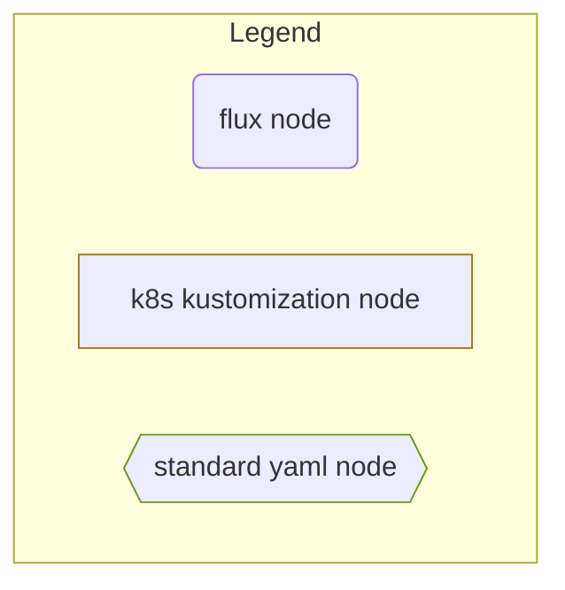
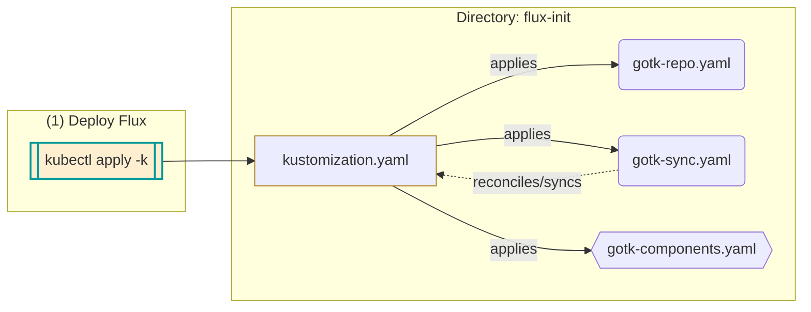
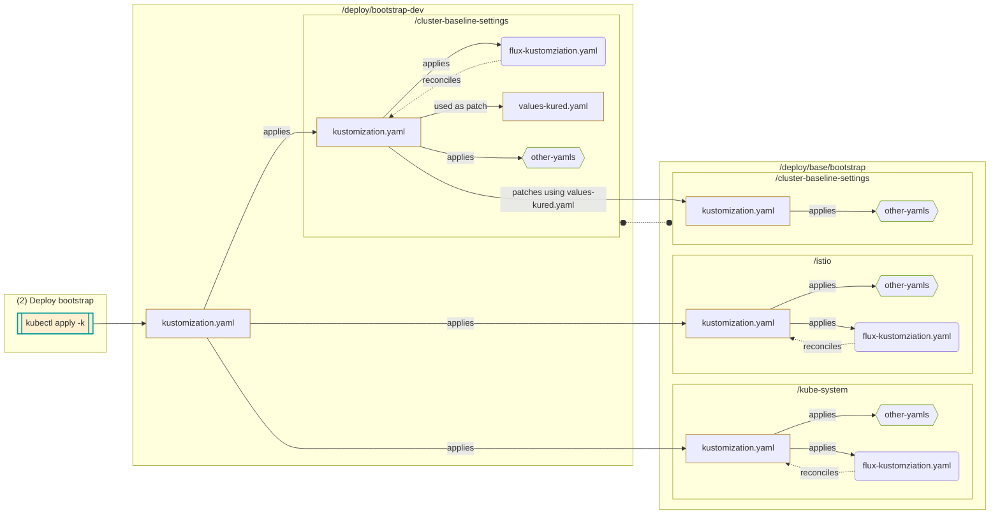
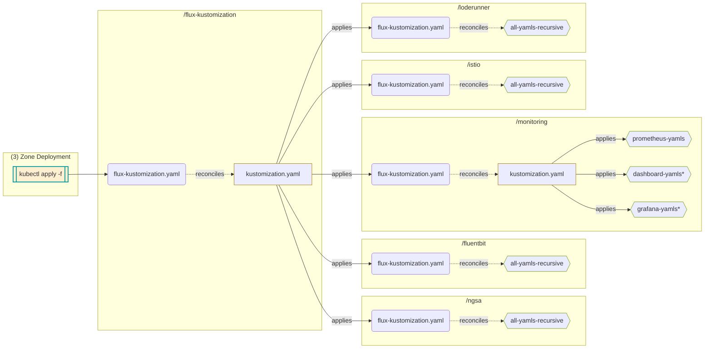

# Flux directory structure for NGSA ASB Clusters (dev and preprod)

To make use of Flux's features we've adopted the following dir structure based on our original ASB repo structure.

**Note:** _A Flux Kustomization CRD will always look for a `kustomization.yaml` file in a specified path. Otherwise it will generate one from the content of the directory. See [Kustomization doc (`path`description)](https://fluxcd.io/flux/components/kustomize/api/#kustomize.toolkit.fluxcd.io/v1beta2.KustomizationSpec)_

## `flux-init` Directory

```bash
flux-init
├── init-dev
│   ├── gotk-components-dev.yaml
│   ├── gotk-repo.yaml
│   ├── gotk-sync.yaml # Flux kustomzn: Kustomization for flux-init/init-dev
│   ╰── *(1)kustomization.yaml # k8s kustmzn: 1. <kubectl apply -k> applies all yaml files above
╰── init-pre
    ├── gotk-components-pre.yaml
    ├── gotk-repo.yaml
    ├── gotk-sync.yaml # Applies yamls in flux-init/init-pre for reconciliation
    ╰── *(1)kustomization.yaml # k8s kustmzn: 1. <kubectl apply -k> applies all yaml files above
```

## `deploy/bootstrap` Directory

```bash
deploy
├── base/bootstrap # Base yamls which acts as base for all zone/bootstrap specific patches
│   ├── istio
│   │   ├── <YAMLS>
│   │   ╰── istio-flux-kustomization.yaml # Flux kustmzn: applies kustomization for this dir
│   ├── cluster-baseline-settings
│   │   ╰── <YAMLS>
│   ╰── kube-system
│       ├── <YAMLS>
│       ╰── azm-flux-kustomization.yaml # Flux kustmzn: applies kustomization for this dir
├── bootstrap-dev
│   ├── cluster-baseline-settings
│   │   ├── kustomization.yaml # k8s kustmzn: Specifies resource to apply and values to path (values-<app>.yaml)
│   │   ├── values-<app>.yaml # Patches resource from base/bootstrap folder
│   │   ╰── cluster-baseline-flux-kustomization.yaml # Flux kustmzn: applies kustomization for this dir
│   ╰── *(2)kustomization.yaml # k8s kustmzn: applies cluster-baseline-settings/kustomization.yaml, then base/bootstrap
╰─── bootstrap-pre
        ╰── cluster-baseline-settings
            ╰── <similar yamls as bootstrap-dev>
```

## Zone specific directory (e.g. `deploy/dev-ngsa-asb-eastus`)

```bash
# Showing EastUS dev dir structure as example. Other cluster dir structures should be fairly similar
deploy/dev-ngsa-asb-eastus
├── fluentbit
│   ├── <YAMLS>
│   ╰── fluentbit-flux-kustomization.yaml # Flux kustmzn: applies kustomization for this dir
├── flux-kustomization
│   ├── *(3)eastus-dev-kustomization.yaml # Flux kustmzn: applies kustomization for this dir
│   ╰── kustomization.yaml # k8s kustmzn: Applies yaml resources in specific order
├── istio
│   ├── <YAMLS>
│   ╰── istio-flux-kustomization.yaml # Flux kustmzn: applies kustomization for this dir
├── loderunner
│   ├── dev/loderunner
│   │   ╰── <YAMLS>
│   ╰── loderunner-flux-kustomization.yaml # Flux kustmzn: applies kustomization for this dir and subdir
├── monitoring
│   ├── grafana
│   │   ├── <YAMLS>
│   │   ╰── dashboards<dir have yamls>
│   ├── thanos
│   │   ╰── <YAMLS>
│   ├── <YAMLS>
│   ├── kustomization.yaml # k8s kustmzn: Applies yaml resources in specific order
│   ╰── monitoring-flux-kustomization.yaml # Flux kustmzn: applies kustomization for this dir and subdirs
╰── ngsa
    ├── dev
    │   ╰── ngsa<dirs and YAMLS>
    ├── <YAMLS>
    ╰── ngsa-flux-kustomization.yaml
```

> *`(1)`, `(2)` and `(3)` represents the order of operations (`kubectl apply`) to setup a cluster with Flux GitOps.
>
> See the flowcharts below for order of operations and detailed chart of dependencies

## Directory Operation Flowchart



### `flux-init` flowchart



### `bootstrap` flowchart



### Zone specific flowchart

> Showing `deploy/dev-ngsa-asb-eastus`


