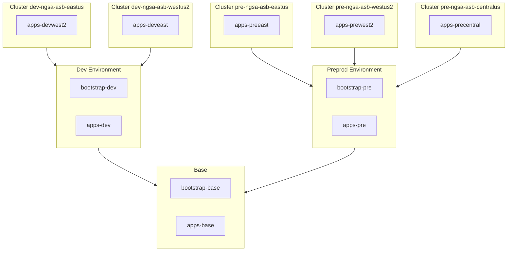

# NGSA App Kustomizations

## Kustomize Layers for NGSA

Kubernetes Kustomize allows for specialization of Kubernetes files and Helm charts by applying overlays on top of base versions of files. This provides ability to chain bulding out configurations in a layered approach reducing the need for duplication of our infrastructure description code.

For NGSA ASB platform build out, the process involves 3 layers:

- Base - layer that contains infrastructure description shared between all clusters
- Environment - layer that contains infrastructure description shared between all clusters within a deployment environment (ie. Development or Preproduction)
- Cluster Specific - layer that contains environment description that is specific to an individual cluster

