# Web Application Firewall (WAF) Allocation/De-Allocation Automation

Azure Firewall has [costs (Azure Firewall pricing link)](https://azure.microsoft.com/en-gb/pricing/details/azure-firewall/#pricing) associated with it which can be optimized by allocating and de-allocating the firewall when appropriate.  Below describes the mechanism to implement an Azure Automation Runbook that will allocate and de-allocate the firewall on a schedule as well as enable and disable the alerts associated with this activity to minimize nonessential systems communications.

## Before Beginning

### Prerequisites

Before proceeding verify  the environment is configured correct to execute the commands necessary below

- Azure CLI 2.0 or greater [Install Azure CLI](https://learn.microsoft.com/en-us/cli/azure/install-azure-cli)

- Azure CLI Extension for Automation [Install Azure CLI Extensions](https://learn.microsoft.com/en-us/cli/azure/azure-cli-extensions-list)

- Azure CLI Extension for Monitor [Install Azure CLI Extensions](https://learn.microsoft.com/en-us/cli/azure/azure-cli-extensions-list)

- *Azure Powershell modules for Linux* [Install Modules](/allocationAutomationForFirewall.md#Install-Powershell-Modules)

*The Azure CLI Automation extension is in an experimental stage.  Currently it does not implement all functionality needed.  As a result the the Az Module, specifically for automation, monitoring,  and authentication can be used at the time of writing.*

- [*Azure CLI Extension - Automation*](https://github.com/Azure/azure-cli-extensions/tree/main/src/automation)
- [Azure PowerShell Az Modules](https://learn.microsoft.com/en-us/powershell/azure/install-az-ps?view=azps-9.0.0)

### Parameters Needed to Proceed

#### Parameters for Bash Execution

| Parameter Name | Example Value | Script Needed For |
| -------------- | :-----------: | ---------------- |
| ASB_FW_TenantId | 00000000-0000-0000-0000-000000000000 | bash |
| ASB_FW_SubscriptionId | 00000000-0000-0000-0000-000000000000 | bash  |
| ASB_FW_Sku | Basic | bash |
| ASB_FW_Location | eastus | bash  |
| ASB_FW_PowerShell_Runbook_File_Name | firewallAutomationForCostOptimization.ps1 | bash |
| ASB_FW_PowerShell_Runbook_Description | This runbook automates the allocation and de-allocation of a firewall for the purposes of scheduling. | bash |
| ASB_FW_Environment | dev | bash |
| firewallName        |             fw-centralus             | bash |

#### Parameters for PowerShell Execution

| Parameter Name | Example Value | Script Needed For |
| -------------- | :-----------: | ---------------- |
|Tenant_Id|00000000-0000-0000-0000-000000000000| PowerShell |
|Subscription_Name|| PowerShell |
|Subscription_Id|00000000-0000-0000-0000-000000000000| PowerShell |
|Resource_Group_Name_for_Automation|rg-ngsa-asb-firewall-automation-dev| PowerShell |
|Resource_Group_Name_with_Firewall|rg-ngsa-asb-dev-hub| PowerShell |
|Resource_Group_Name_with_Alerts|rg-ngsa-asb-dev| PowerShell |
|Location|westus| PowerShell |
|Automation_Account_Name|aa-ngsa-asb-firewall-automation-dev| PowerShell |
|Sku|Basic| PowerShell |
|PowerShell_Runbook_Name|rb-ngsa-asb=firewall-automation-dev| PowerShell |
|Vnet_Name|vnet-eastus-hub| PowerShell |
|Firewall_Name|fw-eastus| PowerShell |
|PIP_Name1|pip-fw-eastus-01| PowerShell |
|PIP_Name2|pip-fw-eastus-02| PowerShell |
|PIP_Name_Default|pip-fw-eastus-default| PowerShell |
|Managed_Identity_Name|mi-ngsa-asb-firewall-automation-dev| PowerShell |
|Base_Schedule_Name|as-ngsa-asb-firewall-automation-dev| PowerShell |
|Environment|dev| PowerShell |

### Infrastructure & Assets Creation List

The following infrastructure assets should be established in the subscription with the Azure Firewall(s) to be managed once all aspects of this document are fulfilled.  Though six (6) items are listed, technically one (1) item is an import of content to the body of the Azure Automation Runbook so this item will not show up in the portal without deeper investigation.  

|     | Resource                                  |                                                                                       Links                                                                                      | Description                                                                                                                                                                 |
| :-: | :---------------------------------------- | :------------------------------------------------------------------------------------------------------------------------------------------------------------------------------: | --------------------------------------------------------------------------------------------------------------------------------------------------------------------------- |
|  1. | Resource Group                            |                                                 [link](https://learn.microsoft.com/en-us/cli/azure/manage-azure-groups-azure-cli)                                                | Create "sibling" resource group in subscription for Azure Automation infrastructure.                                                                                        |
|  2. | Automation Account                        |                     [link](https://learn.microsoft.com/en-us/azure/templates/microsoft.automation/automationaccounts?pivots=deployment-language-arm-template)                    | Create an Automation Account that will execute the automation.                                                                                                              |
|  3. | User-Assigned Managed Identity            | [link](https://learn.microsoft.com/en-us/azure/active-directory/managed-identities-azure-resources/how-manage-user-assigned-managed-identities?pivots=identity-mi-methods-azcli) | Create an identity for the Automation Account.                                                                                                                              |
|  4. | Automation Runbook with Powershell        |                                      [link](https://learn.microsoft.com/en-us/azure/automation/automation-runbook-types#powershell-runbooks)                                     | Create a Runbook of type Powershell.                                                                                                                                        |
|  5. | Powershell Content in Runbook             |                               [link](https://learn.microsoft.com/en-us/powershell/module/az.automation/import-azautomationrunbook?view=azps-8.3.0)                               | Upload [pre-defined Powershell content](../automation/FirewallToggle.ps1) into the Runbook body.                                                                            |
|  6. | Automation Schedule(s) *using Powershell* |                               [link](https://learn.microsoft.com/en-us/powershell/module/az.automation/import-azautomationrunbook?view=azps-8.3.0)                               | Create the schedules that will execute the Firewall automation.  These had to be created using Powershell instead of the Azure CLI.  No equivalent behavior has been found. |                                |

### Resources Created When Complete

   1. Azure user-assigned Managed Identity
   2. Azure Automation Account
   3. Azure PowerShell Runbook
  
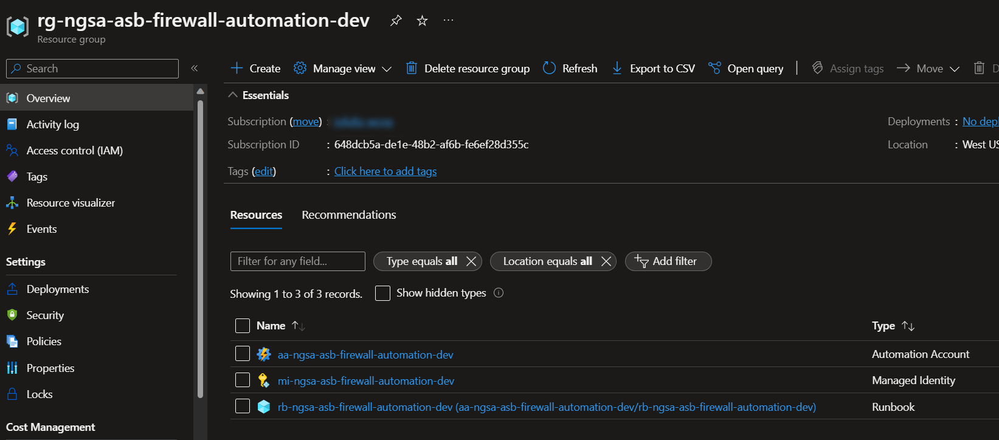

## Choosing the Installation Method

The instructions below show three manners to accomplish the same objective.  

Choose **ONLY** one.

1. [Portal](#portal) - Using the Azure Portal to create all artifacts
2. [CLI & Az PowerShell Modules](#azure-cli-and-az-powershell-modules) - Using a terminal and executing the PowerShell and Bash CLI commands interactively
3. Executing the Bash and PowerShell Scripts Provided.  

### Portal

Note if you chose a "portal based installation" please follow the instructions below.  

Create a resource group within the subscription and tenant that contains the firewalls.  This new resource group will house three resources as shown below.

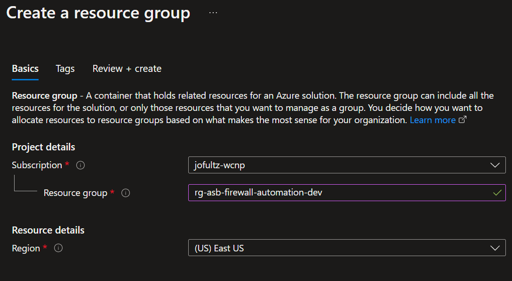

#### Create User-Assigned Managed Identity

Navigate to the newly created resource group and click the "+" to add a new resource

Search for "User Assigned Managed Identity".

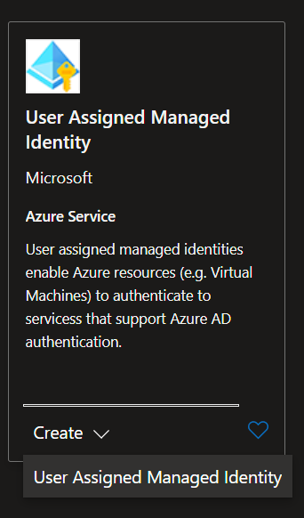

Fill out the "Create User Assigned Managed Identity" Basics tab information as depicted below.  

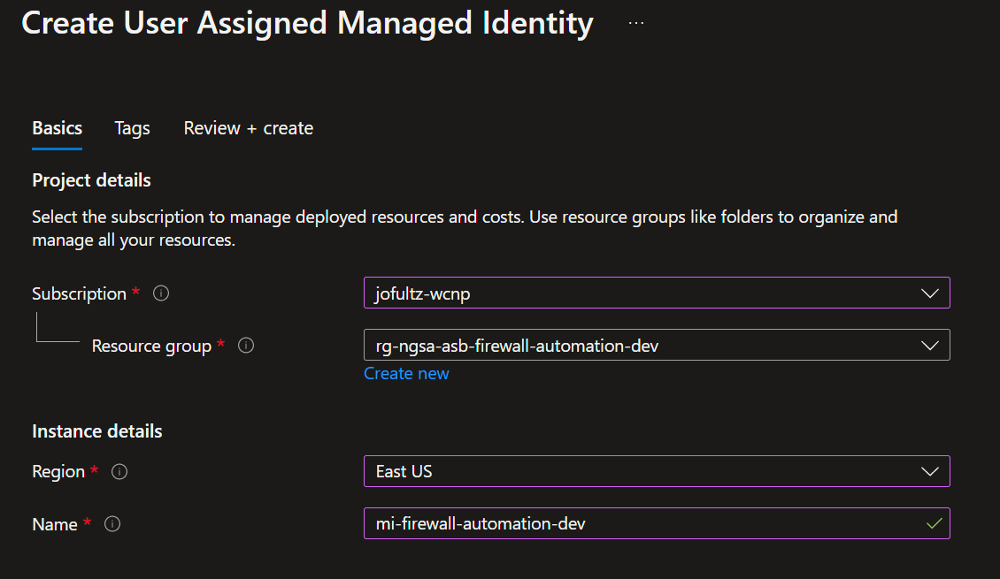

Click Create.

##### Adding Roles to the User-Assigned Managed Identity

Navigate to the resource group we created above.  

Click on the user-assigned Managed Identity created named *'mi-nsga-asb-firewall-automation-dev'*

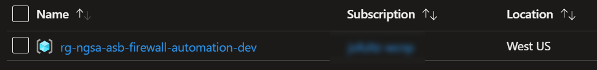

Click on the portal blade "Access Control (IAM)

Click "Add Role Assignment"

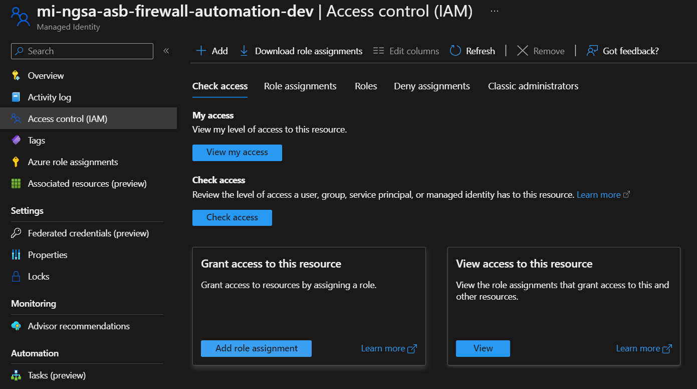

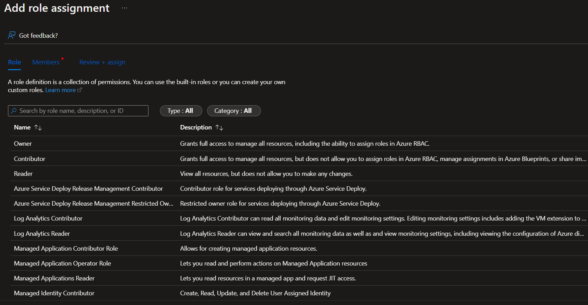

Select 'Contributor' or 'Managed Identity Contributor'.  Both roles need to be added

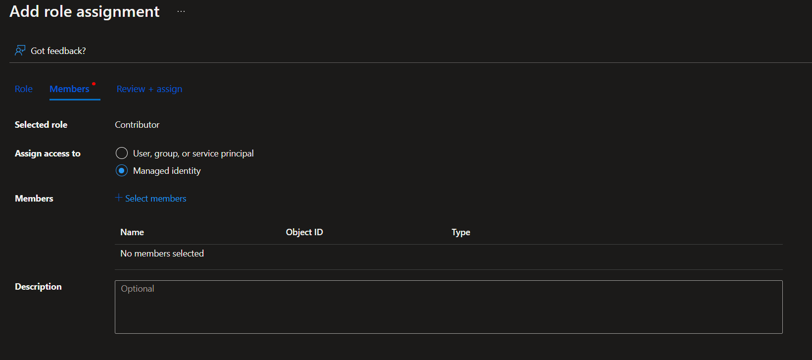

Locate the user-assigned managed identity created earlier from the list 'mi-ngsa-asb-firewall-automation-dev'

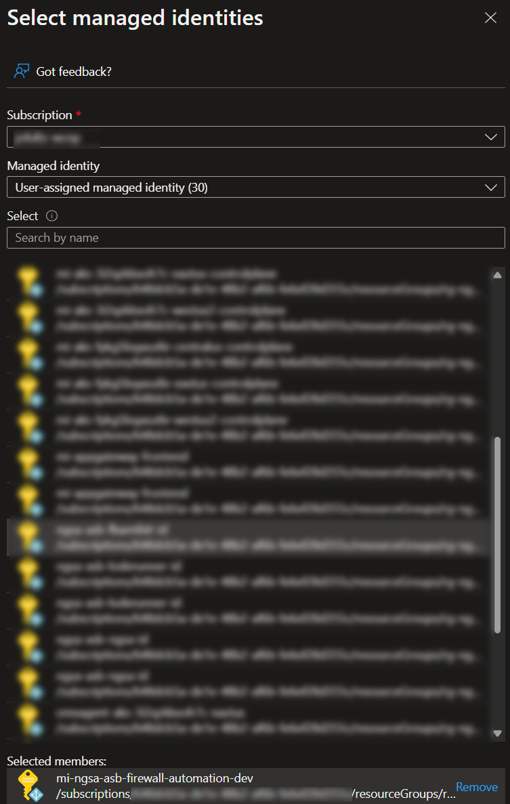

Click "create" to complete.  Repeat tis process for the role not done the first time until both the 'Contributor and the "Managed Identity Contributor" roles are added.

#### Create Azure Automation Account

Navigate the the newly created resource group 'rg-ngsa-asb-firewall-automation-dev' and click the "+" icon to add a resource to the resource group.  Search for "Automation".  

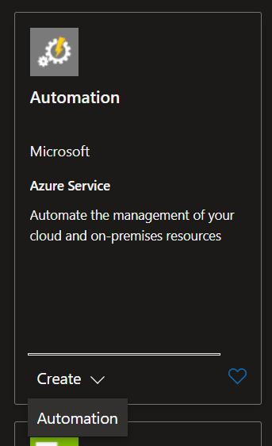

Once selected fill out the tabs for the "Create an Automation Account" screens.  

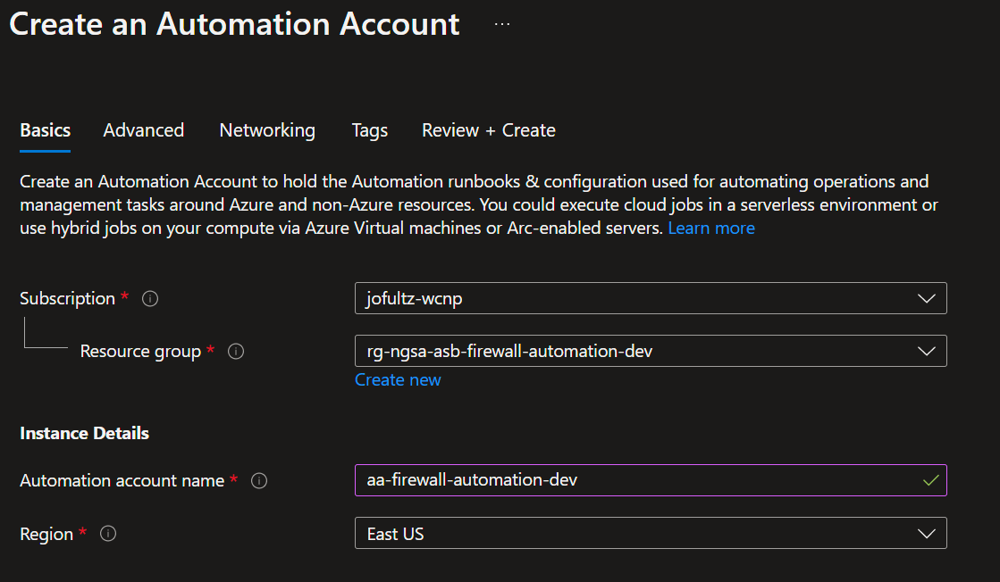

automation account name: 'aa-ngsa-asb-firewall-automation-dev' Note, slightly different from the image above.

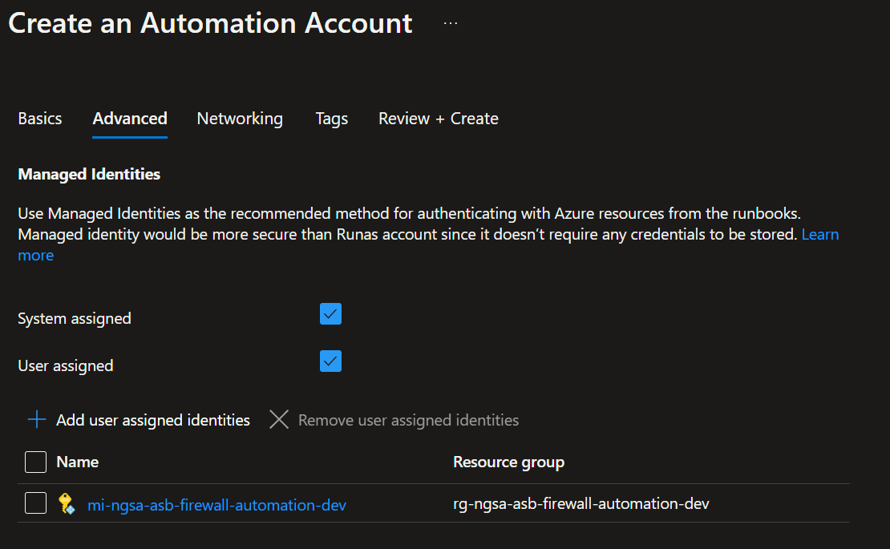

Select both the system-assigned, as well as the user-assigned managed identities check boxes as well as select the 'mi-ngsa-asb-firewall-automation-dev' managed identity to associate it with the Automation Account.

Click create when finished.  

#### Create Automation PowerShell Runbook

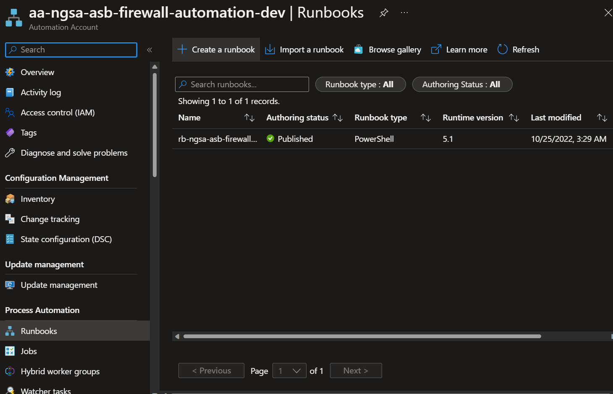

Navigate to the automation account created, 'aa-ngsa-asb-firewall-automation-dev' and select the 'Runbook' blade, and "Create a runbook.  

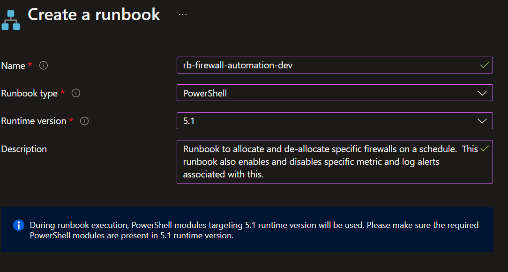

Create an Azure Powershell Runbook from the Azure Portal within the Automation Resource Group or using the Azure CLI

Use the portal UX upload the Powershell runbook file located in the scripts/automation directory

#### Create Automation Schedules

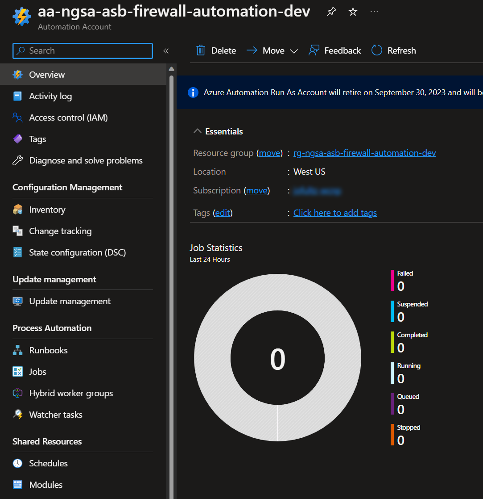

Select the "Schedules" blade on the left side of the Autoamtion Account screen.

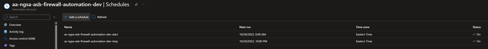

Establish the schedule desired for the firewall automation.  The Schedule decides for this implementation was to turn the development firewall off at 10:00 PM EST and back on at 6:00 AM EST.  

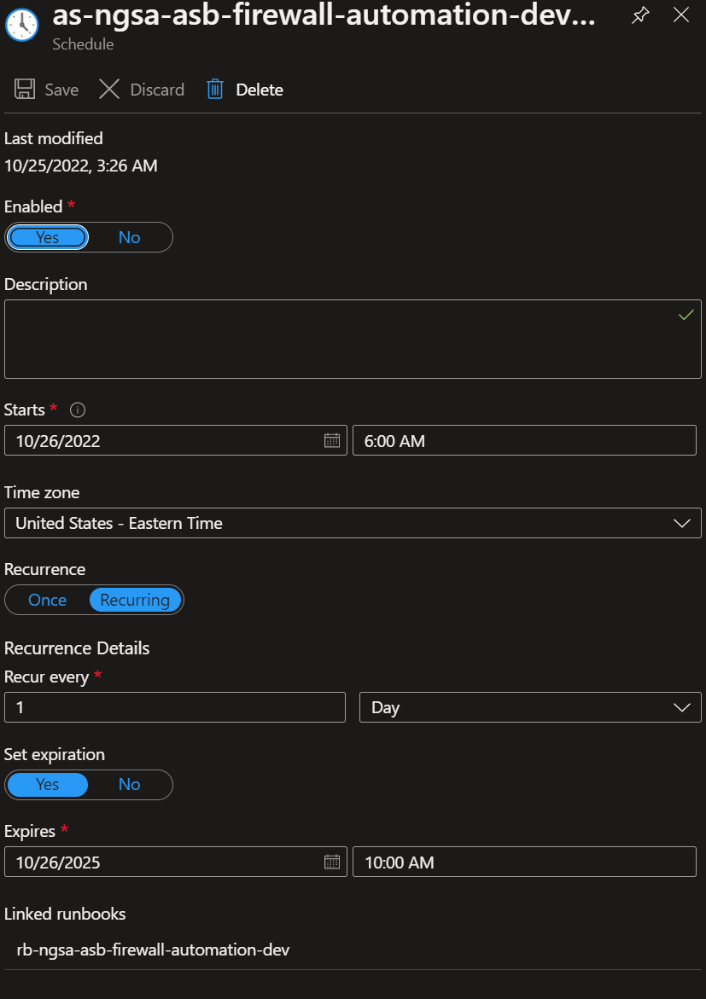

Link the runbook and the schedule

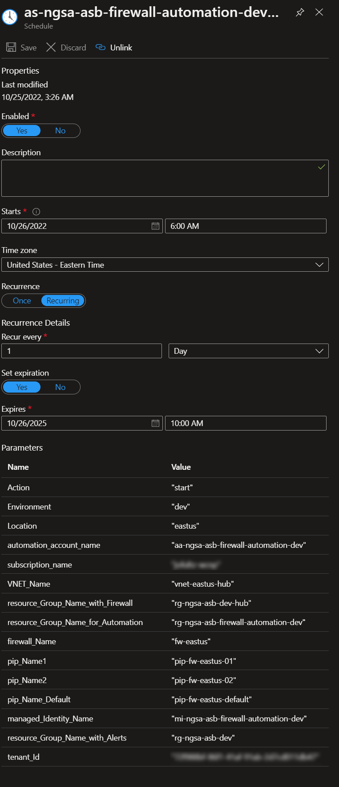

Once linked, the defaulted values located within the Runbook will be visible.  

### Azure CLI & Az PowerShell Modules

#### Create the Resource Group with the Azure CLI

The following commands authenticate a user to a specified tenant and then switches into the desired subscription.  

Once authentication and authorization is established the Azure CLI is used to create a resource group.  

   ```bash

    # Log into the tenant
    az login --tenant {tenant Id}

    # Set the subscription desired    
    az account set --subscription {subscription name}
    
    # pass in resource group  name and location
    az group create -name {automation resource group name} -location {location}

   ```

#### Create User-Assigned Managed Identity with Azure CLI and PowerShell

Creates the Azure user-assigned managed identity and adds the permissions needed.

``` bash

# Log into the tenant
az login --tenant {tenant Id}

# Set the subscription desired    
az account set --subscription {subscription name}

az identity create --resource-group {automation resource group name} --name {user-assigned managed identity name}

# The Az CLI commands for this errored at the time of writing so pwsh was used.
# Assigns the system-assigned user identity
pwsh --command "Connect-AzAccount -UseDeviceAuthentication -Tenant {tenant id} -Subscription {subscription Id}; Set-AzAutomationAccount -AssignUserIdentity /subscriptions/{subscription Id}/resourcegroups/{automation resource group name}/providers/Microsoft.ManagedIdentity/userAssignedIdentities/{user-assigned managed identity name} -ResourceGroupName {automation resource group name} -Name {automation account name} -AssignSystemIdentity;"

# assigns the role
az role assignment create --assignee-object-id {user-assigned managed identity principal id} --assignee-principal-type 'ServicePrincipal' --role 'Monitoring Contributor' --subscription {subscription name}

# assigns the role
az role assignment create --assignee-object-id {user-assigned managed identity principal id} --assignee-principal-type 'ServicePrincipal' --role 'Contributor' --subscription {subscription name}

```

```bash
  
    # Log into the tenant
    az login --tenant {tenant Id}

    # Set the subscription desired    
    az account set --subscription {subscription name}
  
    az automation account create --automation-account-name {automation account name} --location {location} --sku 'Basic' --resource-group {automation resource group name}

  ```

The Azure CLI command for this action was causing errors at the time of writing this.  The following command allows for creating a PowerShell "shell" so that the Az PowerShell module can be used.  

```bash

# Log into the tenant
    az login --tenant {tenant Id}

    # Set the subscription desired    
    az account set --subscription {subscription name}
  
pwsh -command "Install-Module -Name Az.Automation; New-AzAutomationRunbook -Type 'PowerShell' -AutomationAccountName {automation account name} -Name {runbook name} -ResourceGroupName {automation resource group name};"

az automation runbook replace-content --automation-account-name {automation account name} --resource-group {automation resource group name} --name {runbook name} --content @"{path to runbook file}"

```

#### Create Automation Account

``` bash
# Log into the tenant
az login --tenant {tenant Id}

# Set the subscription desired    
az account set --subscription {subscription name}

# Create automation account
az automation account create --automation-account-name {automation account name} --location {location} --sku 'Basic' --resource-group {automation resource group name}

```

##### Assign user-assigned Managed Identity to Automation Account

``` bash

# a name for our azure ad app
appName="{automation account name}-application"

# The name of the app role that the managed identity should be assigned to.
appRoleName='Managed Identity Operator' # For example, MyApi.Read.All

#turn on system-assigned managed identity 
pwsh --command "Connect-AzAccount -UseDeviceAuthentication -Tenant {tenant id} -Subscription {subscription id}; Set-AzAutomationAccount -AssignUserIdentity /subscriptions/{subscription id}/resourcegroups/{automation resource group name}/providers/Microsoft.ManagedIdentity/userAssignedIdentities/{user-assigned managed identity name} -ResourceGroupName {automation resource group name} -Name {automation account name} -AssignSystemIdentity;"

#assign role
az role assignment create --assignee {automation account principal id} --role 'Managed Identity Operator' --scope "/subscriptions/{subscription id}/resourcegroups/{automation resource group name}/providers/Microsoft.Automation/automationAccounts/{automation account name}"

```

#### Create Automation PowerShell Runbook Artifacts

``` bash
# Log into the tenant
az login --tenant {tenant Id}

# Set the subscription desired    
az account set --subscription {subscription name}

pwsh -command "Install-Module -Name Az.Automation; New-AzAutomationRunbook -Type 'PowerShell' -AutomationAccountName {automation account name} -Name {runbook name} -ResourceGroupName {automation resource group name};"

```

#### Create Automation Schedule and Link Runbook

  ```bash
    
    New-AzAutomationSchedule -AutomationAccountName $Automation_Account_Name -Name $schedule_Name -StartTime $start_Time -ExpiryTime $end_Time -DayInterval 1 -ResourceGroupName $Resource_Group_Name_for_Automation

    $params = @{}
    $params.Add("resource_Group_Name_with_Firewall", "$Resource_Group_Name_with_Firewall")
    $params.Add("resource_Group_Name_for_Automation", "$Resource_Group_Name_for_Automation") 
    $params.Add("automation_Account_Name", "$Automation_Account_Name")  
    $params.Add("tenant_Id", "$tenant_Id")
    $params.Add("resource_Group_Name_with_Alerts", "$Resource_Group_Name_with_Alerts")
    $params.Add("subscription_Name", "$subscription_Name")
    $params.Add("vnet_Name", "$vnet_Name")
    $params.Add("firewall_Name", "$firewall_Name")
    $params.Add("pip_Name1", "$pip_Name1")
    $params.Add("pip_Name2", "$pip_Name2")
    $params.Add("pip_Name_Default", "$pip_Name_Default")
    $params.Add("managed_Identity_Name", "$managed_Identity_Name")
    $params.Add("environment", "$Environment")
    $params.Add("action", "$action")
    $params.Add("location", "$Location")

    Register-AzAutomationScheduledRunbook -Parameters $params -ResourceGroupName $Resource_Group_Name_for_Automation -AutomationAccountName $Automation_Account_Name -RunbookName $powerShell_Runbook_Name -ScheduleName $schedule_Name


  ```


1. LInk the Runbook to the schedules

### ADVANCED - Automated Scripts to Run

BEFORE continuing please make sure all requirements have been met in the section labeled [prerequisites]("#-prerequisites").

1. [Create Automation Infrastructure (BASH script)]("./scripts/automatoin/createAutomationForFirewallCostOptimization.sh")
  
  The [createAutomationForFirewallCostOptimization.sh]("./scripts/automation/createautimationForFirewallCostOptimization.sh") script "dot sources" the [firewallAutomationForCostOptimization.variables.sh]("./scripts/automation/cfirewallAutomationForCostOptimization.variables.sh").  
  *This file must to be adjusted for the specifics of the execution.*

#### BASH Variables

The BASH variables are exported into environment variables.  

``` bash
# Tenant Id for the onmicrosoft.com tenant
export ASB_FW_Tenant_Id=''
export ASB_FW_Subscription_Name=''
export ASB_FW_Base_NSGA_Name='ngsa-asb'
export ASB_FW_Base_Automation_System_Name='firewall-automation'
export ASB_FW_Environment='dev'
export ASB_FW_PowerShell_Runbook_File_Name='firewallAutomationForCostOptimization.Runbook.ps1'
export ASB_FW_Sku='Basic'
export ASB_FW_Location='westus'
export ASB_FW_PowerShell_Runbook_Description='This runbook allocates and de-allocates specific firewalls.  It also enables and disables specific metric and log alerts associated with such activities.'

```

Below will detail what is being executed within the script files for further understanding.  This section is informational only.

#### Adjust Variables

The file [firewallAutomationForCostOptimization.variables.sh]("./scripts/automation/cfirewallAutomationForCostOptimization.variables.sh") must be adjusted to include relevant values.

*Sensitive values such as subscription Id have been omitted*

``` bash
ASB_FW_Tenant_Id=''
ASB_FW_Subscription_Name=''
ASB_FW_Base_NSGA_Name='ngsa-asb'
ASB_FW_Base_Automation_System_Name='firewall-automation'
ASB_FW_Environment='dev'
ASB_FW_PowerShell_Runbook_File_Name='firewallAutomationForCostOptimization.Runbook.ps1'
ASB_FW_Sku='Basic'
ASB_FW_Location='westus'
ASB_FW_PowerShell_Runbook_Description='This runbook automates the allocation and de-allocation of a firewall for the purposes of scheduling.'

```

#### Executing Script

Once the variables are adjusted the script must be run from Visual Studio Code (thick client) using Codespaces.  the script does not require input parameters because they are provided in the variable file mentioned above.

``` bash

  ./createAutomationForFirewallCostOptimization.sh

```

To create the schedules execute the PowerShell script createSchedulesFirewallAutomationForCostOptimization.ps1.  This script must be executed in Codespaces as well, and must have parameters passed to it.  

``` PowerShell

createSchedulesFirewallAutomationForCostOptimization.ps1 
    -Tenant_Id '{tenant id}' 
    -Subscription_Name '{subscription name}' 
    -Subscription_Id '{subscription id}' 
    -Resource_Group_Name_for_Automation 'rg-ngsa-asb-firewall-automation-dev' -Resource_Group_Name_with_Firewall 'rg-ngsa-asb-dev-hub' 
    -Location 'westus' 
    -Automation_Account_Name 'aa-ngsa-asb-firewall-automation-dev' 
    -Sku 'Basic' 
    -PowerShell_Runbook_Name 'rb-ngsa-asb-firewall-automation-dev' 
    -Vnet_Name 'vnet-eastus-hub' 
    -Firewall_Name 'fw-eastus' 
    -PIP_Name1 'pip-fw-eastus-01' 
    -PIP_Name2 'pip-fw-eastus-02' 
    -PIP_Name_Default 'pip-fw-eastus-default' 
    -Managed_Identity_Name 'mi-ngsa-asb-firewall-automation-dev' 
    -Base_Schedule_Name 'as-ngsa-asb-firewall-automation-dev' 
    -Environment 'dev'

```
