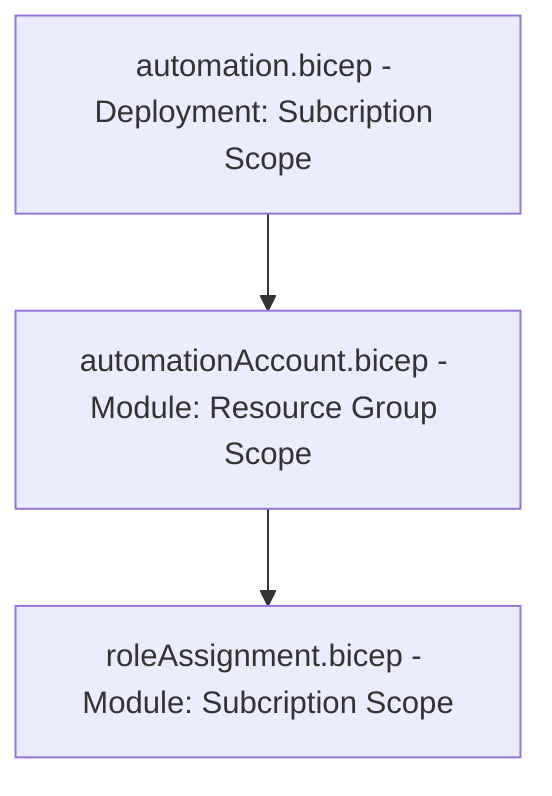

# Azure Resource Automation

Azure Automation implemenation for bringing up and shutting down Azure resources on a schedule.  This work was implemented in order to provide a flexible way to stop and start costly resources based on a regular schedule.

## Getting Started

These instructions provide steps to create automation infrastructure as well as the runbooks to start/stop resources at a specified time of the day.

The automation currently supports:

- AKS Cluster and Application Gateways set up as pairs in NGSA-ASB repository

### Prerequisites

Requirements for using this bicep deployment:

- Azure subscription
- Account to execute bicep deployments on that subscription (account should have at least contributor role to subscription)
- Log analytics workspace for automation logging

## Deployment Structure



### The following resources are created by running deployment

- Resource Group (All resources will be created inside this resource group)
- User Assigned Managed Identity (Will be used by the automation account to run the runbooks)
  - Role Assignment (adds contributor role to the subscription for managed identity)
- Automation Account (Account that performs all autmation tasks and contains schedules, runbooks, and jobschedules)
  - Schedules (Two schedules are created, one for start of the workday and one for end of the workday, these execute on weekdays only and are set to timezone specified in a parameter)
  - Runbooks (Runbooks that will be used for the automation)
  - Job Schedules (Assigns a schedule and run parameters to the runbooks)
  - Diagnostic Settings (Adds diagnostic settings to the Automation Account)

## Running the Bicep Deployment (Azure CLI)

1. Log into Azure Subscription with Account that has Contributor role
2. Set up the bicep parameters to match your environment, this is done in automation.parameters.json file

    | Parameter Name | Type |Description |
    |----------------|------|-------|
    |automationSuffix| string |String that will be used to name the resource group, automation account, and managed identity |
    |logAnalyticsWorkspaceId| string |Resource Id for the log analytics workspace, this is fully qualified id wiht subscription , resource group, etc.|
    |clusterGwStartStopRunbookURL| string |URL to the raw format script that will be used to create the runbooks for stopping and starting the cluster and gateways - we are using the Github URL to the raw file |
    |scheduleStartOfDayTime| string |Time to run star of day jobs in the format HH:MM:SS|
    |scheduleEndOfDayTime| string |Time to run end of day jobs in the format HH:MM:SS|
    |scheduleTimezone| string |timezone to use for schedules|
    |logVerbose |bool |turn verbose logging on/off|
    |logProgress|bool |turn log progress on/off|
    |resourcesToAutomate|array[object]|Array of objects that define what needs to be automated  - gateway, and cluster (assumes they are in the same resource group) |

3. Change directory to ResourceAutomation directory, this is the directory that contains the automation.bicep file as well as automation.parameters.json file

   ``` shell
      cd /workspaces/ngsa-asb/scripts/ResourceAutomation
   ```

   ❗NOTE: The path above is the path if you are working in a codespace, if you are working on a local version the path may be different

4. Run the following command

   ``` shell
      az deployment sub create \
        --location eastus \
        --template-file automation.bicep \
        --parameters @automation.parameters.json
   ```

   ❗NOTE: Run the above command with --what-if switch to show what changes running the deployment would make
