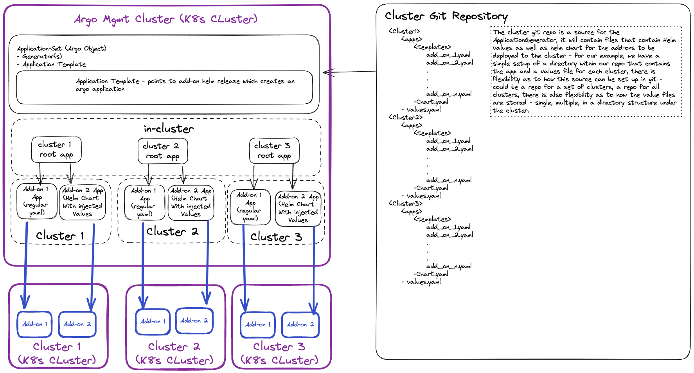

# Deploying Add-ons to K8's Clusters Using Argo CD ApplicationSets

The purpose of this example is to illustrate how ArgoCD can be used to deploy cluster add-ons at scale while leveraging GitOps principles. Argo CD is a declarative, GitOps continuous delivery tool for Kubernetes.

## What is a cluster add-on?

A cluster add-on is component that is deployed to a Kubernetes cluster at the cluster level.  These add-ons are components leveraged by the applications that are deployed to the cluster.  For instance, application team may want their deployed application to provide metrics data to Prometheus, in this case the infrastructure/ops team would install the prometheus operator after cluster is created.

Given that there may be a large number of these add-ons and that infrastructure/ops teams could be managing thousands of clusters, there is a desire to have an automated way to deploy and maintain these add-ons on the clusters.

## Needs/Functionality

### General

- Add-ons should be able to be installed via various methods: HELM, YAML, shell scripts, etc. :white_check_mark:
- For helm deployments there should be an ability to overwrite values with context from the destination cluster or external values files :white_check_mark:
- Add-on install/upgrade/removal should be performed in an automated fashion :white_check_mark:
- Add-ons should be validated after install :white_check_mark:
- Add-ons should be able to require dependencies to be available before they are installed :white_check_mark:
- Add-ons should be able to be deployed at scale (potentially thousands of clusters)

### Add On Management

- Which add-ons are available to be installed to the clusters should be able to be managed by the individuals responsible for the add on and not the individuals responsible for the cluster
- The individuals responsible for the add-on should be able to make new versions of add-ons

### Observability

- Visibility to status of install
- Visibility to result of install (success/failure)

## Implementations

### Argo Components/Concepts to be Used in this Implementation

- [Application Controller](https://argo-cd.readthedocs.io/en/stable/operator-manual/architecture/#application-controller) - Kubernetes controller that monitors and maintains current state of running applications in sync with the desired state (as specified in repo)
- [Application](https://argo-cd.readthedocs.io/en/stable/operator-manual/declarative-setup/#applications) - Kubernetes custom resource that represents a deployed application instance in an environment.
- [ApplicationSet Controller](https://argo-cd.readthedocs.io/en/stable/operator-manual/server-commands/argocd-application-controller/) - Kubernetes controller that creates application resources based on a template and parameters used by the template.
- [ApplicationSet](https://argo-cd.readthedocs.io/en/stable/operator-manual/applicationset/) - Kubernetes custom resource that is used by the ApplicationSet Controller to create Argo applications based on generated parameters and a template.
- [Generators(matrix, list, cluster)](https://argo-cd.readthedocs.io/en/stable/operator-manual/applicationset/Generators/) - Generators generate parameters that can be used in the template of the ApplicationSet.
- [Sync Waves](https://argo-cd.readthedocs.io/en/stable/user-guide/sync-waves/) - Sync waves are used to control order of what resources are sychronized.
- [App of apps pattern](https://argo-cd.readthedocs.io/en/stable/operator-manual/cluster-bootstrapping/#app-of-apps-pattern) - This is the pattern that is used in this implementation to deploy cluster add-ons.

### App of apps per cluster

> **Note**
> In order to use sync waves with app of apps pattern, a CRD that was removed in 1.8 needs to be restored.  
> <https://argo-cd.readthedocs.io/en/stable/operator-manual/upgrading/1.7-1.8/#health-assessment-of-argoprojioapplication-crd-has-been-removed>

### App of apps per application

> **Note**
> This approach does not provide capability to sequence deployments enforcing dependencies

Additional Argo CD Resources:

- [Argo CD Core Concepts](https://argo-cd.readthedocs.io/en/stable/core_concepts/)
- [Argo CD Architectural Overview](https://argo-cd.readthedocs.io/en/stable/operator-manual/architecture/)
