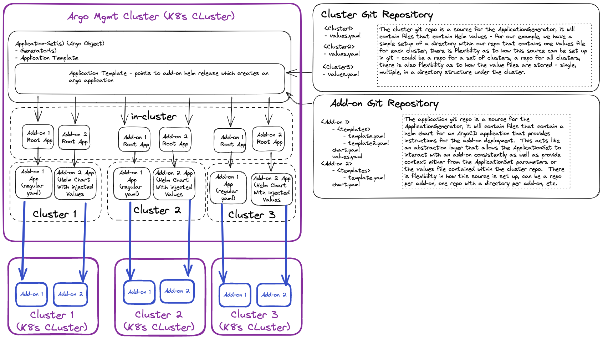

# Deploying Add-ons to K8's Clusters

## What is a cluster add-on?

An add-on is component that is deployed to a Kubernetes cluster at the cluster level.  These add-ons are components leveraged by the applications that are deployed to the cluster.  For instance, application team may want their deployed application to provide metrics data to Prometheus, in this case the infrastructure/ops team would install the prometheus operator after cluster is created.

Given that there may be a large number of these add-ons and that infrastructure/ops teams could be managing thousands of clusters, there is a desire to have an automated way to deploy and maintain these add-ons on the clusters.

## Personas

- Cluster Owner
  - Decides which add ons are installed on their clusters
  - Can own one or multiple clusters
- Add-on Owner
  - Makes add-ons available for installing on clusters
  - Controls the build pipeline for the add on

## Needs/Functionality

### General

- Add-ons should be able to be installed via various methods: HELM, Kubectl, shell scripts, etc.
- Add-ons should be able to be deployed to thousands of clusters - baseline 25k
- Add-on install/upgrade/removal should be performed in an automated fashion
- Add-ons should be validated after install
- What add-ons get deployed to what clusters should be able to be defined by the person responsible for the cluster
- Add-ons should be able to require dependencies to be available before they are installed

### Add On Management

- Which add-ons are available to be installed to the clusters should be able to be managed by the individuals responsible for the add on and not the individuals responsible for the cluster
- Add-on managers should be able to make new versions of add-ons

### Observability

- Visibility to what add-ons and their versions are installed in each cluster
- Visibility to status of install
- Visibility to result of install (success/failure)

## Questions

- What is the trigger for add-ons being installed to cluster?
- How are add-ons selected to be added to clusters?

## Argo CD

Argo CD is a declarative, GitOps continuous delivery tool for Kubernetes.

Argo CD Resources:

- [Core Concepts](https://argo-cd.readthedocs.io/en/stable/core_concepts/)
- [Architectural Overview](https://argo-cd.readthedocs.io/en/stable/operator-manual/architecture/)

### Argo Components to be Used

- ApplicationSet
- Application
- Generators (matrix, list, cluster)
- Sync Waves
- Projects

### Idea: Use app of apps pattern to inject values into applications (Helm or other flavors)

App of app pattern: <https://argo-cd.readthedocs.io/en/stable/operator-manual/cluster-bootstrapping/#app-of-apps-pattern>

In this approach the add on owner uses app of apps pattern to deploy their add-on, there is a wrapper helm chart which will take in parameters from the generator.  
The helm chart can specify anything in its template(s) - call other helm charts, do a plain yaml deployment, etc.

