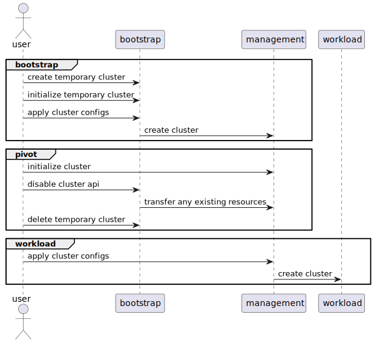

# Cluster API AKS provisioning spike

This document walks through an introductory setup of AKS provisioning with Cluster API using the [boostrap and pivot](https://cluster-api.sigs.k8s.io/clusterctl/commands/move.html?#bootstrap--pivot) process. The goal is to get up and running, document steps for future automation, and document work items for future research and/or improvements.

This bootstrap and pivot process allows for the same automation to create all clusters in a uniform way with Cluster API. This includes the [management cluster]((https://cluster-api.sigs.k8s.io/reference/glossary.html#management-cluster)) itself that needs to run Cluster API. Another benefit is a clear boundary between creating a cluster, and bootstrapping it for a specific use case. After a cluster is provisioned by Cluster API, extra automation can then target specific clusters, turning them into Cluster API management clusters.



## Helpful links

- Intro to Cluster API <https://cluster-api.sigs.k8s.io/introduction.html>
- Cluster API quickstart <https://cluster-api.sigs.k8s.io/user/quick-start.html>
- Bootstrap and pivot process <https://cluster-api.sigs.k8s.io/clusterctl/commands/move.html?#bootstrap--pivot>
- Azure provider <https://capz.sigs.k8s.io/>
- AKS support <https://capz.sigs.k8s.io/topics/managedcluster.html>
- Glossary <https://cluster-api.sigs.k8s.io/reference/glossary.html>

## Prerequisites

- AZ CLI [download](https://docs.microsoft.com/en-us/cli/azure/install-azure-cli?view=azure-cli-latest)
- Docker [download](https://docs.docker.com/install/)
- kubectl [download](https://kubernetes.io/docs/tasks/tools/install-kubectl-linux/)
- clusterctl [download](https://cluster-api.sigs.k8s.io/user/quick-start.html#install-clusterctl)
- Access to existing Kubernetes cluster or ability to create a local one
  - example: k3d, kind, minikube, etc

## Using Codespaces

GitHub Codespaces is an easy way to get up and running with all the installed tools.

To open with codespaces:

- Click the Code button on this repository
- Click the Codespaces tab
- Click Create button

## Bootstrap

One of the desired outcomes of this spike is to use Cluster API to create the management cluster, leveraging the automation in the Cluster API infrastructure provider. But, Cluster API needs to run in a Kubernetes cluster. When using this repo's codespaces, K3d is used as the temoprary [bootstrap cluster](https://cluster-api.sigs.k8s.io/reference/glossary.html#bootstrap) that is responsible for creating the management cluster.

### Create local bootstrap cluster

Create k3d cluster.

```bash

mkdir -p ./spikes/cluster-api/capi-configs

# see Makefile for more info
make create

```

Verify cluster creation.

```bash

kubectl cluster-info
kubectl get pods -A

```

### Gather configuration values for bootstrap cluster setup

Setup the service principal details for Cluster API to use.

```bash

az login --use-device-code

# verify subscription
az account show

# create service principal
export AZURE_SUBSCRIPTION_ID="<SubscriptionId>"
export SP_NAME="<ServicePrincipalName>"

az ad sp create-for-rbac \
  --name $SP_NAME \
  --role contributor \
  --scopes="/subscriptions/${AZURE_SUBSCRIPTION_ID}"

```

Setup environment variables.

```bash

# Setup identity variables.
export AZURE_TENANT_ID="<Tenant>"
export AZURE_CLIENT_ID="<AppId>"
export AZURE_CLIENT_SECRET="<Password>"

export AZURE_LOCATION="<Azure Location>"

# Base64 encode the variables
export AZURE_SUBSCRIPTION_ID_B64="$(echo -n "$AZURE_SUBSCRIPTION_ID" | base64 | tr -d '\n')"
export AZURE_TENANT_ID_B64="$(echo -n "$AZURE_TENANT_ID" | base64 | tr -d '\n')"
export AZURE_CLIENT_ID_B64="$(echo -n "$AZURE_CLIENT_ID" | base64 | tr -d '\n')"
export AZURE_CLIENT_SECRET_B64="$(echo -n "$AZURE_CLIENT_SECRET" | base64 | tr -d '\n')"

# Settings needed for AzureClusterIdentity used by the AzureCluster
export AZURE_CLUSTER_IDENTITY_SECRET_NAME="cluster-identity-secret"
export CLUSTER_IDENTITY_NAME="cluster-identity"
export AZURE_CLUSTER_IDENTITY_SECRET_NAMESPACE="default"

```

### Initialize bootstrap cluster

Create identity k8s secret.

```bash

kubectl create secret generic "${AZURE_CLUSTER_IDENTITY_SECRET_NAME}" \
  --from-literal=clientSecret="${AZURE_CLIENT_SECRET}"

```

Initilize bootstrap cluster with Azure [provider](https://cluster-api.sigs.k8s.io/reference/glossary.html#infrastructure-provider).

```bash

# AKS managment features are enabled with these feature flags.
export EXP_AKS=true
export EXP_MACHINE_POOL=true
export CLUSTER_TOPOLOGY=true

clusterctl init --infrastructure azure

```

### Gather configuration values for AKS cluster setup

Setup environment variables for the AKS cluster

```bash

# Select VM types. Use command below to check available VM sizes.
# az vm list-skus -l $AZURE_LOCATION -r virtualMachines -o table

export AZURE_CONTROL_PLANE_MACHINE_TYPE="Standard_D2s_v3"
export AZURE_NODE_MACHINE_TYPE="Standard_D2s_v3"

export BASE_CAPI_CONFIG_DIR="./spikes/cluster-api/capi-configs"
export MANAGEMENT_CLUSTER_YAML_PATH="${BASE_CAPI_CONFIG_DIR}/capi-quickstart-management.yaml"
export MANAGEMENT_CLUSTER_KUBECONFIG_PATH="${BASE_CAPI_CONFIG_DIR}/capi-quickstart-management.kubeconfig"

```

Name of the resource group where resources from this spike will be deployed.

```bash

export AZURE_RESOURCE_GROUP="<Resource group name>"

```

Create resource group.

```bash

az group create --name $AZURE_RESOURCE_GROUP --location $AZURE_LOCATION

```

Generate AKS cluster configuration yaml files.

```bash

clusterctl generate cluster capi-quickstart-management \
  --kubernetes-version v1.24.0 \
  --control-plane-machine-count=3 \
  --worker-machine-count=3 \
  --flavor=aks \
  > "$MANAGEMENT_CLUSTER_YAML_PATH"

```

### Bootstrap initial AKS cluster

Apply config files to bootstrap cluster.

```bash

kubectl apply -f "$MANAGEMENT_CLUSTER_YAML_PATH"

```

Validate cluster is up and running. This will take a few minutes.

```bash

# Cluster is ready when it is changes from "Provisioning" to "Provisioned"
kubectl get cluster

clusterctl describe cluster capi-quickstart-management

```

When the AKS cluster is ready, get the kubeconfig.

```bash

clusterctl get kubeconfig capi-quickstart-management > "$MANAGEMENT_CLUSTER_KUBECONFIG_PATH"

```

Validate cluster creation.

```bash

kubectl --kubeconfig="$MANAGEMENT_CLUSTER_KUBECONFIG_PATH" get nodes

```

## Management

The bootstrap phase is now complete. Next is the pivot part or the "bootstrap and pivot" process. The next set of instructions will turn the AKS cluster into a management cluster.

### Initilize management cluster

Add identity secret to AKS cluster.

```bash

kubectl --kubeconfig="$MANAGEMENT_CLUSTER_KUBECONFIG_PATH" \
  create secret generic "${AZURE_CLUSTER_IDENTITY_SECRET_NAME}" \
  --from-literal=clientSecret="${AZURE_CLIENT_SECRET}"

```

### Pivot

Initialize the AKS cluster, turning it into a management cluster.

```bash

export EXP_AKS=true
export EXP_MACHINE_POOL=true
export CLUSTER_TOPOLOGY=true

clusterctl init --kubeconfig="$MANAGEMENT_CLUSTER_KUBECONFIG_PATH" --infrastructure azure

```

Disable cluster reconciliation on the bootstrap cluster and copy any Cluster API objects.

<https://cluster-api.sigs.k8s.io/clusterctl/commands/move.html>

> There is an expected error from the command below. This does not prevent this walkthrough from proceeding. See [clusterctl move command error](#clusterctl-move-command-error) TODO section for more info.

```bash

clusterctl move --to-kubeconfig="$MANAGEMENT_CLUSTER_KUBECONFIG_PATH"

```

The temporary bootstrap cluster can now be deleted.

```bash

# see Makefile for more info
make delete

```

## Workload

The management AKS cluster that was created by ClusterAPI is now ready to start creating [workload clusters](https://cluster-api.sigs.k8s.io/reference/glossary.html#workload-cluster).

### Create workload cluster from management cluster

Generate configuration for a workload cluster.

```bash

export WORKLOAD_CLUSTER_NAME="capi-quickstart-workload-01"
export WORKLOAD_CLUSTER_YAML_PATH="${BASE_CAPI_CONFIG_DIR}/${WORKLOAD_CLUSTER_NAME}.yaml"
export WORKLOAD_CLUSTER_KUBECONFIG_PATH="${BASE_CAPI_CONFIG_DIR}/${WORKLOAD_CLUSTER_NAME}.kubeconfig"

clusterctl generate cluster "$WORKLOAD_CLUSTER_NAME" \
  --kubeconfig="$MANAGEMENT_CLUSTER_KUBECONFIG_PATH" \
  --kubernetes-version v1.24.0 \
  --control-plane-machine-count=3 \
  --worker-machine-count=3 \
  --flavor=aks \
  > "$WORKLOAD_CLUSTER_YAML_PATH"

```

> Manually update nodepool names in generated yaml. See [AzureManagedMachinePool name conflict](#azuremanagedmachinepool-name-conflict) TODO section for more details.
>
> Simplest option for quick start:
>
> - replace pool0, and pool1 in generated template with a cluster unique name
> - example: replace pool0 with w01pool0, and pool1 with w01pool1.

Apply AKS workload cluster config files to management cluster.

```bash

kubectl --kubeconfig="$MANAGEMENT_CLUSTER_KUBECONFIG_PATH" \
  apply -f "$WORKLOAD_CLUSTER_YAML_PATH"

```

Validate. It will take a few minutes for cluster to be ready.

```bash

# Cluster is ready when it is changes from "Provisioning" to "Provisioned"
kubectl --kubeconfig="$MANAGEMENT_CLUSTER_KUBECONFIG_PATH" \
  get cluster

clusterctl describe cluster \
  --kubeconfig="$MANAGEMENT_CLUSTER_KUBECONFIG_PATH" \
  "$WORKLOAD_CLUSTER_NAME"

```

When the workload cluster is ready, get the kubeconfig.

```bash

clusterctl get kubeconfig \
  --kubeconfig="$MANAGEMENT_CLUSTER_KUBECONFIG_PATH" "$WORKLOAD_CLUSTER_NAME" \
  > "$WORKLOAD_CLUSTER_KUBECONFIG_PATH"

```

### Workload post-create

Test some commands in the workload cluster.

```bash

# view nodes
kubectl --kubeconfig="$WORKLOAD_CLUSTER_KUBECONFIG_PATH" get nodes

# run hello-world pod
kubectl --kubeconfig="$WORKLOAD_CLUSTER_KUBECONFIG_PATH" run hello-world --image=hello-world

# view logs
kubectl --kubeconfig="$WORKLOAD_CLUSTER_KUBECONFIG_PATH" logs hello-world

# delete hello world pod
kubectl --kubeconfig="$WORKLOAD_CLUSTER_KUBECONFIG_PATH" delete pod hello-world

```

## TODOs and follow up research

- [ ] investigate issue where cluster's storage profile is being updated every few minutes.
  - the update are alternating between adding and removing the storageProfile field from the cluster's properties
- [ ] how to prevent accidental cluster deletes
  - processes and permissions required to prevent user and service principal from accidentally deleting resources
- [ ] observability into Cluster API actions and progress
  - observed cluster switching between "Succeeded(Running)" and "Updating(Running)"
- [ ] quick start links to docs for setting up service principal. <https://capz.sigs.k8s.io/topics/getting-started.html#prerequisites>
  - it includes a deprecation warning with another link to recommended approach
  - > The capability to set credentials using environment variables is now deprecated and will be removed in future releases, the recommended approach is to use AzureClusterIdentity as explained [here](https://capz.sigs.k8s.io/topics/multitenancy.html)
- [ ] handle service principal credential expiration and rotation
  - how does customer currently handle secret rotation for service principals?
- [ ] The AKS cluster is created with default CNI
  - Look into using Cilium
  - there is a "spec.networkPlugin" option to control the network plugin for azuremanagedcontrolplanes.
  - need to investigate if there is an option for Bring your own CNI preview feature.
- [ ] Add cluster to an existing vnet and subnet
- [ ] Research other pre and post cluster create needs from customer and provide guidance
- [ ] Research alternatives to Codespaces for setting up bootstrap environment

### AzureManagedMachinePool name conflict

- [ ] Issue when creating multiple AKS clusters using default AKS template.
  - MachinePool and AzureManagedMachinePool CRDs that are generated by the AKS template are hardcoded to pool0 and pool1
  - causes conflict error when k8s tries to patch immutable fields on existing AzureManagedMachinePool with the same name
  - potential solutions:
    1. generate cluster config files in their own namespace
    1. unique templatized metatadata.name with simple AzureManagedMachinePool.spec.name for the actual node pool name
        - AzureManagedMachinePool has spec.name that can be set to the simple pool0 and pool1
        - The the different pool related CRDs can have more unique metadata.name values
        - nodepool name has specific restrictions but, these should not apply to the k8s CRD metadata.name
        - <https://docs.microsoft.com/en-us/azure/aks/troubleshooting#what-naming-restrictions-are-enforced-for-aks-resources-and-parameters>
    1. Look into using custom templates, yaml generation, and potentially some post processing to futher customize templates
        - Look into using custom templates, yaml generation, and potentially some post processing to futher customize templates
        - <https://cluster-api.sigs.k8s.io/clusterctl/commands/generate-cluster.html>
        - <https://cluster-api.sigs.k8s.io/clusterctl/commands/generate-yaml.html>
        - <https://cluster-api.sigs.k8s.io/clusterctl/commands/generate-cluster.html#alternative-source-for-cluster-templates>

### clusterctl move command error

- [ ] Error from cluster move command. This does not seem to affect the walkthrough. Investigate.

```bash

Performing move...
Discovering Cluster API objects
Moving Cluster API objects Clusters=1
Moving Cluster API objects ClusterClasses=0
Creating objects in the target cluster
Deleting objects from the source cluster
Error: action failed after 10 attempts: error deleting "infrastructure.cluster.x-k8s.io/v1beta1, Kind=AzureManagedMachinePool" default/pool0: admission webhook "validation.azuremanagedmachinepools.infrastructure.cluster.x-k8s.io" denied the request: if the delete is triggered via owner MachinePool please refer to trouble shooting section in https://capz.sigs.k8s.io/topics/managedcluster.html: AKS Cluster must have at least one system pool

```
