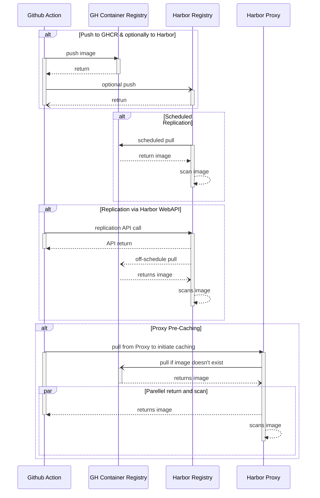
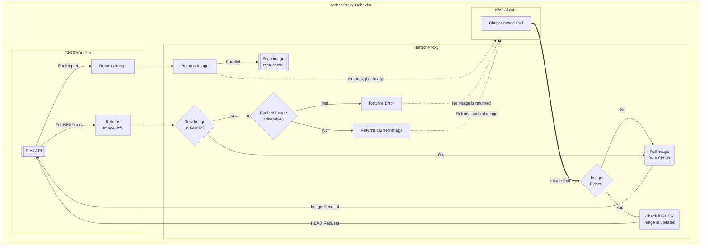

# Deploy Harbor

## Azure ASB Cluster

> The steps below are guidelines for the dev cluster, but is replicable for the pre-prod as well

* Create a dns entry for Harbor (e.g. `harbor-core-westus2-dev` for WestUS2)
  in `rg-ngsa-asb-dev/cse.ms` private dns and put the LoadBalancer IP address for the region.
  * You can find LoadBalancer for your cluster under `rg-ngsa-asb-dev-nodepools-{REGION}`
  * Or you can check existing dns entries for same region
* Create a public dns entry (e.g. `harbor-core-westus2-dev` for WestUS2)
  in `dns-rg/cse.ms` and put the public ip for the regional cluster
  * You can find the public IP in Application Gateway for the cluster
    (e.g `rg-ngsa-asb-dev/apw-aks-{HASH}-{REGION}` )
  * Or you can check existing dns entries for same region
* Add the settings below for Harbor (similar to NGSA apps) in Application Gateway:
  * Backend pool
  * Backend settings
    * If using a health probe, use `/api/v2.0/health` Harbor endpoint
  * Listeners (http and https)
  * Rules (http and https)
* [Optional] Add an exception for the harbor-host in the WAF policy (e.g. for
  WestUS2-dev you'll add it in `rg-ngsa-asb-dev/ngsa-asb-waf-policy-westus2`)

At this point Harbor should be ready to deploy.
Now we need to make sure our cluster can pull the Harbor container images.
We will push Harbor images into our cluster's private ACR repo
  (e.g. `rg-ngsa-asb-dev/acraks3i2qzkkxofr7c`).

* Goto your private ACR instance, and click on `Networking`
* Check `Add your client IP address` and save
  * This will add your machine's IP addr which will enable you to view and
    push registries into this ACR.
* Now we push all required Harbor images to the ACR with `az acr import`.

  ```bash
  # Select proper subscription for your ACR and login to the account
  az account set -s "jofultz-wcnp" --output table
  az login --scope https://management.core.windows.net//.default

  # Now push images to ACR
  ## Here we're using docker image TAG v2.5.3 and ACR acraks3i2qzkkxofr7c
  az acr import --source docker.io/goharbor/chartmuseum-photon:v2.5.3 -n acraks3i2qzkkxofr7c
  az acr import --source docker.io/goharbor/harbor-core:v2.5.3 -n acraks3i2qzkkxofr7c
  az acr import --source docker.io/goharbor/harbor-db:v2.5.3 -n acraks3i2qzkkxofr7c
  az acr import --source docker.io/goharbor/harbor-exporter:v2.5.3 -n acraks3i2qzkkxofr7c
  az acr import --source docker.io/goharbor/harbor-jobservice:v2.5.3 -n acraks3i2qzkkxofr7c
  az acr import --source docker.io/goharbor/harbor-portal:v2.5.3 -n acraks3i2qzkkxofr7c
  az acr import --source docker.io/goharbor/harbor-registryctl:v2.5.3 -n acraks3i2qzkkxofr7c
  az acr import --source docker.io/goharbor/nginx-photon:v2.5.3 -n acraks3i2qzkkxofr7c
  az acr import --source docker.io/goharbor/notary-server-photon:v2.5.3 -n acraks3i2qzkkxofr7c
  az acr import --source docker.io/goharbor/notary-signer-photon:v2.5.3 -n acraks3i2qzkkxofr7c
  az acr import --source docker.io/goharbor/redis-photon:v2.5.3 -n acraks3i2qzkkxofr7c
  az acr import --source docker.io/goharbor/registry-photon:v2.5.3 -n acraks3i2qzkkxofr7c
  az acr import --source docker.io/goharbor/trivy-adapter-photon:v2.5.3 -n acraks3i2qzkkxofr7c
  ```

After that, modify the required YAML files to prepare for deployment:

* In [helm-values.yaml](./spikes/harbor/helm-values.yaml):
  * Change the `repository:` and `tag:` value pairs (13 of them) to point to the proper ACR repo and tag
  * Set the Harbor portal admin password (`harborAdminPassword:` )
* In [harbor-virtual-svc.yaml](./spikes/harbor/harbor-virtual-svc.yaml)
  * If deploying to a different namespace than `harbor`, change the namespace value

Now that all of the setup is done, we're ready to deploy:
> Default user for Harbor portal is admin.
>
> Default password should be set in `helm-values.yaml` file before deployment.

```bash
# Assuming we're at REPO_ROOT
# Add Harbor helm repo and update
helm repo add harbor https://helm.goharbor.io
helm repo update

helm install -f spikes/harbor/helm-values.yaml harbor harbor/harbor -n harbor --create-namespace

kubectl apply -f spikes/harbor/harbor-virtual-svc.yaml
```

### Use images in Harbor for deployments/pods

To pull directly from Harbor repo, since Harbor is a is a private repo, we need to add our Harbor auth information to kubernetes.

Follow the steps below:

* We need to add our Harbor Repo Url to Policy and Firewall whitelist:
  * Add the repo url `harbor-core-eastus-dev.cse.ms/` to Image-pull whitelist Policy under `rg-ngsa-dev-asb` resource group
    * Policy location: Azure Portal -> `rg-ngsa-asb-dev` resource group -> Policies -> Assignments -> Under `Kubernetes cluster containers should only use allowed images` add the url to the regex.
  * Add the repo url `harbor-core-eastus-dev.cse.ms` to ASB Firewall whitelist as well.
    * Region specific FireWall: Azure Portal -> `rg-ngsa-asb-dev-hub` resource group -> `fw-policies-<REGION>` -> Rule Collection
* Now create a user account in a Harbor Project.
  * Project's page -> `Robot Accounts` -> `Add a new robot account` with at least pull permission.
  * Upon the user creation, it will provide a one-time key which can be used as password.
  * PS: Instead of project specific robot user, we can also create a global robot user
* Create a kubernetes `docker-registry` secret

  ```bash
    read -sr PASSWORD # In this way the password won't be saved to shell history
    kubectl create secret docker-registry harbor-regcred --docker-server=https://harbor-core-eastus-dev.cse.ms --docker-username='<USERNAME>' --docker-password="$PASSWORD" -n ngsa
  ```

* Note: the `harbor-regcred` is the secret name, which will be used by deployments to pull from Harbor. So it should be in the same namespace as the deployment (in above cmd, its `ngsa`).
* In the deployment file, add imagePullSecrets to allow the deployment to pull from the repo:

```yaml
...
  imagePullSecrets: # Same level as `containers:`
    - name: harbor-regcred
  containers:
    - name: app
      image: ghcr.io/retaildevcrews/ngsa-app:beta
      imagePullPolicy: Always
      args: 
      - --in-memory
      - --prometheus
      - --zone
      - az-eastus-dev
      - --region
      - eastus
  ...
```

With these steps, Kubernetes should be able to pull the image from Harbor repo.

> Followed the steps in official Kubernetes documentation: ["Pulling from private repo"](https://kubernetes.io/docs/tasks/configure-pod-container/pull-image-private-registry/#create-a-secret-by-providing-credentials-on-the-command-line)

## Locally or in a VM with Docker

For deploying Harbor locally we need to have these tools available:

* Bash
* Docker
* Docker Compose
* [Optional] Login to Dockerhub (to pull images)

### Steps

Follow the steps below (based on [installation config](https://goharbor.io/docs/1.10/install-config/)):

1. Download the **online** installer `wget https://github.com/goharbor/harbor/releases/download/{VERSION}/harbor-online-installer-{VERSION}.tar.gz` file from [harbor github release page](https://github.com/goharbor/harbor/releases)
    > Notes: Download the online installer: e.g `wget https://github.com/goharbor/harbor/releases/download/v2.5.1/harbor-online-installer-v2.5.1.tgz`

2. Extract the archive (assuming the extracted path is `$HARBOR_PATH`)

3. Copy `harbor.yml` to `$HARBOR_PATH` (so that `harbor.yml` will be in the same directory as `install.sh`)

4. Generate certificate for HTTPS access.

    ```bash
    # Here replace $HARBOR_PATH with the extracted dir path
    ./gen-multi-domain-certs.bash --cert-path ${HARBOR_PATH} --cert-prefix harbor-ssl -san 127.0.0.1,localhost,harboar.core.local,harbor.notary.local,harbor.local
    ```

5. Change `certificate` and `private_key` entry in `harbor.yml` file and point to `$HARBOR_PATH/harbor-ssl.crt` and `$HARBOR_PATH/harbor-ssl.key`.

    > *Note:* Use full path for `certificate` and `private_key`

6. Run the installer

    ```bash
    # Here replace $HARBOR_PATH with the extracted dir path
    cd $HARBOR_PATH
    sudo ./install.sh
    ```

7. Try `docker ps` and try the ports for `harbor-nginx` and `harbor-portal`.

## Sequence diagram for Harbor Registry and Proxy

The diagram shows four different use cases to use Harbor Proxy and Harbor Registry with existing CI/CD pipeline which includes caching and vulnerability scans.



## Flowchart for Harbor Proxy

The flowchart shows how Harbor proxy can be used in tandem with a standard
GHCR/Docker registry, providing cache and vulnerability scans.


<!-- FOLLOW UP:

- [X] AAD Integration - Delete any local user (other than admin) then integrate
- [X] Repository replication from/to other repo
- [X] Repository proxy
  - [X] Can Harbor act as a proxy to other registries
    - Ans: It can
  - [X] If Harbor doesn't have an image, can it pull from a know public registry and deliver
    - Ans: It can pull from most known repos, given we provide an endpoint with proper Access Keys
- [X] What happens if scanner finds issue in harbor? DevOps flow [Assuming `Prevent vulerable images from running` is selected]
  - When the scanner is running, we can't pull It will show this msg

    ```bash
        Error response from daemon: unknown: current image with "Running" status of vulnerability scanning cannot be pulled due to configured policy in 'Prevent images with vulnerability severity of "Low" or higher from running.' To continue with pull, please contact your project administrator for help.
    ```

  - Once scan is finished, it will let it pass depending on the scanner result
  - For proxy repo, the image is first pulled from source, made available to the pull
    - Then its scanned, and added to cache
    - Before scanning is finished, it is made available as a passthrough (meaning vulnerable images can be pulled for the first time)
    - At this point if policy allows, it does block further pull if vulnerable
- [X] Harbor can pull/push from remote repo -> Hence it will be able to pull and scan
- [X] Cache and scan
- [X] Replication endpoints Harbor/ACR/GHCR[X]
  - Replication (pull mode) works as usual with endpoints
  - Problem is: after first replication/pull the image is scanned and if the existing image has vulnerabilities
- [X] Azure disk/PVC classes to use in Harbor deployment
  - [X] If Azure disks have redundant backup - usually don't
  - [X] If we can use 3rd party storage used in AKS: We can
- [X] Worklfow diagram**
  - [ X Push, pull (after deployment)
  - [ X Harbor deployment workflow
- [ ] Script is preferred but also explore cluster_admin
  - Fully automatic or semi-automatic

---

- [ ] Make sure from the cluster we can pull from Harbor without going through the internet
  - DNS settings need to be changed in order for local service acting as a registry
- [ ] For Proxy: Configure to pre-pull and scan rather than passthrough before the scan
- [ ] *Multiple Harbor deployment and using Front Door as a one-stop URL -->
