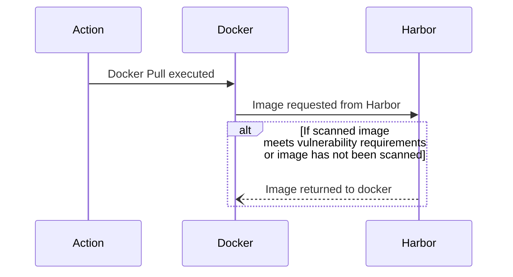
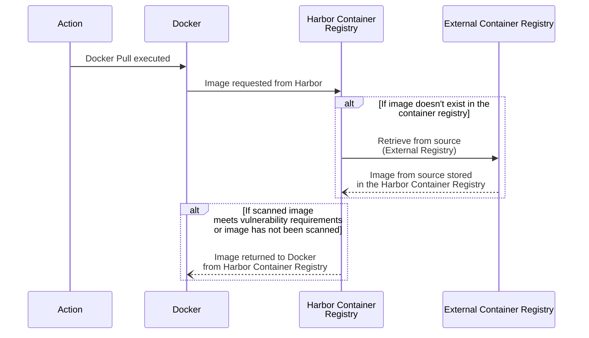
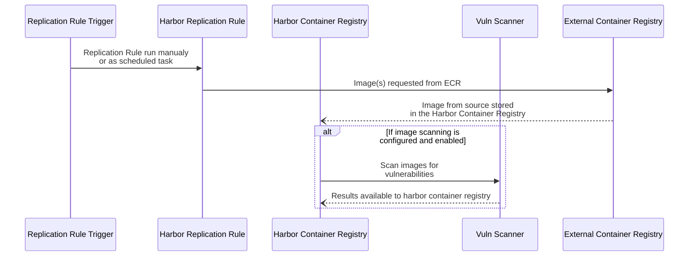
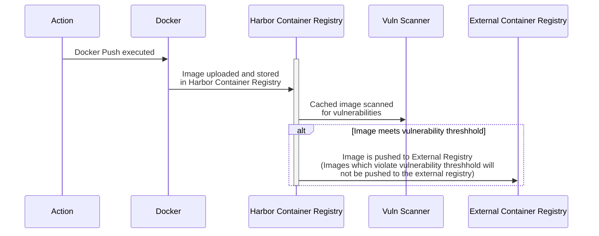

# Scenarios

## Pull image from Harbor Registry

This is the generic flow for pulling an image that exists in the Harbor registry (image cache).

## Proxy Cache - Image Pull from External Registry through Harbor

In Proxy Cache setup, there is no ability to push to external registry
> **_NOTE:_**  It is important to note that in this scenario if the image is pulled from the external registry it will be returned to docker irrespective of vulnerability results as at the time it is returned the image has not been scanned.

## Replicate images from external registry into Harbor Registry

Harbor can pull images from external container registries on a schedule or triggered manually.

## Image Push to external registry

All images are stored in harbor registry, if scanner is turned on for project image is scanned before being made available to pull.  When pushing images to a Harbor instance, it is ensured that an image that has been loaded that violates the vulnerability threshold is not able to be retrieved from that Harbor instance.

